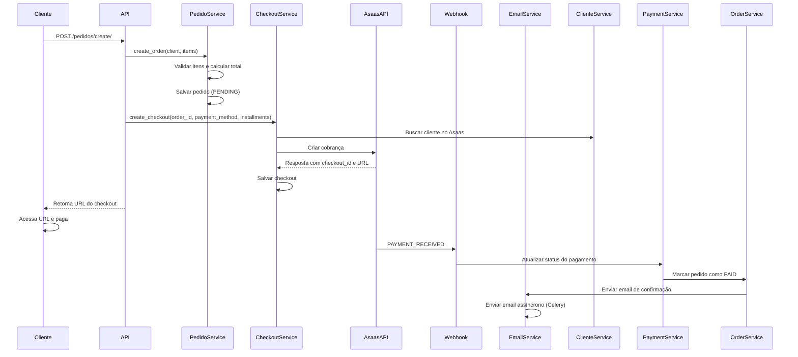
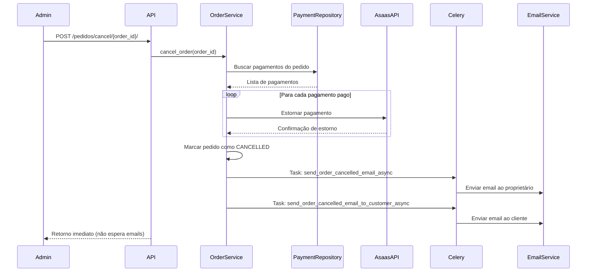
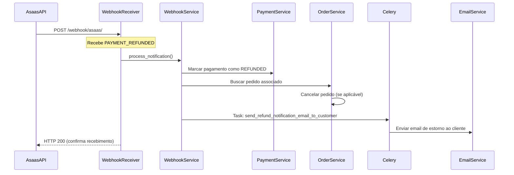
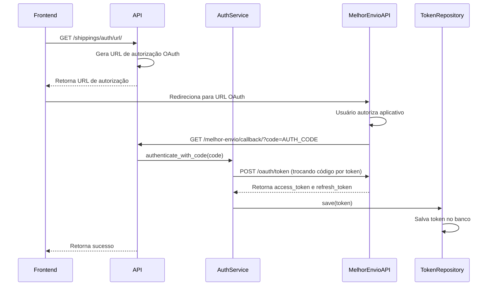
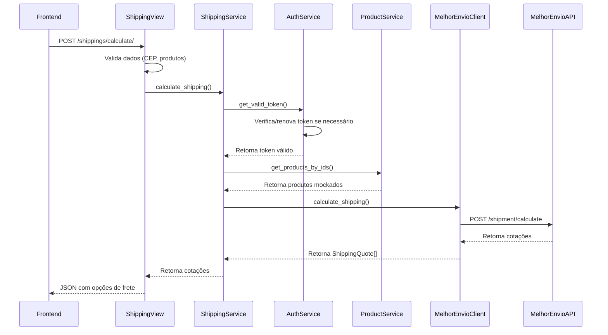

# Documentação Técnica - Fluxo Completo da API de Pagamento e Frete

## Índice

1. [Visão Geral](#visão-geral)
2. [Arquitetura do Sistema](#arquitetura-do-sistema)
3. [Fluxos Principais](#fluxos-principais)
4. [Integração com Asaas](#integração-com-asaas)
5. [Sistema de Webhooks](#sistema-de-webhooks)
6. [Sistema de Emails](#sistema-de-emails)
7. [Processamento Assíncrono com Celery](#processamento-assíncrono-com-celery)
8. [Integração com Melhor Envio](#integração-com-melhor-envio)
9. [Transações e Consistência de Dados](#transações-e-consistência-de-dados)
10. [Modelagem de Dados](#modelagem-de-dados)
11. [Endpoints da API](#endpoints-da-api)
12. [Considerações de Performance](#considerações-de-performance)

---

## Visão Geral

Esta API gerencia o processo completo de pedidos, pagamentos e frete, integrando com o gateway de pagamento Asaas. O sistema foi desenvolvido utilizando:

- **Framework**: Django 5.2 com Django REST Framework
- **Banco de Dados**: PostgreSQL 17
- **Cache/Message Broker**: Redis 7
- **Processamento Assíncrono**: Celery 5.3
- **Gateway de Pagamento**: Asaas API

### Principais Funcionalidades

1. Gestão de usuários e clientes
2. Criação e gestão de pedidos
3. Processamento de pagamentos (PIX e Cartão de Crédito)
4. Pagamentos parcelados
5. Webhooks para notificações de pagamento
6. Cancelamento de pedidos com estorno automático
7. Sistema de notificações por email assíncronas (texto formatado)
8. Integração com Melhor Envio para cálculo de frete
9. Autenticação OAuth com Melhor Envio
10. Gestão de tokens OAuth com renovação automática

---

## Arquitetura do Sistema

### Estrutura de Pastas (Clean Architecture)

```
src/
├── api_pagamento_frete/          # Configurações principais do Django
│   ├── settings.py               # Configurações e variáveis de ambiente
│   ├── celery.py                 # Configuração do Celery
│   └── urls.py                   # Roteamento principal
├── modules/
│   ├── usuario/                  # Módulo de usuários
│   │   ├── domain/               # Regras de negócio
│   │   ├── application/          # Casos de uso
│   │   └── adapters/             # Persistência
│   ├── cliente/                  # Módulo de clientes
│   ├── pedido/                   # Módulo de pedidos
│   ├── pagamento/                # Módulo de pagamentos
│   ├── webhook/                  # Processamento de webhooks
│   ├── checkout/                 # Gerenciamento de checkouts
│   ├── frete/                    # Módulo de frete (Melhor Envio)
│   │   ├── domain/               # Entidades e serviços
│   │   │   ├── entities/         # Token, Product, ShippingQuote
│   │   │   ├── services/         # Auth, Shipping, ProductMock
│   │   │   └── repositories/     # Interfaces de repositório
│   │   ├── application/          # Casos de uso e views
│   │   └── adapters/             # Cliente HTTP, persistência
│   │       ├── external/         # Cliente Melhor Envio
│   │       └── persistence/      # Repositórios Django
│   └── email/                    # Serviço de emails
│       ├── domain/services/      # Lógica de negócio
│       └── tasks.py              # Tasks Celery
└── manage.py
```

### Princípios de Design

- **Clean Architecture**: Separação clara entre domínio, aplicação e infraestrutura
- **Repository Pattern**: Abstração da camada de persistência
- **Dependency Injection**: Inversão de dependências
- **Single Responsibility**: Cada módulo tem uma responsabilidade única

---

## Fluxos Principais

### 1. Fluxo de Criação de Pedido com Pagamento



### 2. Fluxo de Pagamento Parcelado

```
1. Cliente solicita pagamento parcelado
2. Checkout é criado com número de parcelas
3. Asaas processa a primeira parcela
4. Webhook PAYMENT_RECEIVED é recebido para cada parcela
5. Sistema verifica se todas as parcelas foram pagas
6. Quando completar, pedido é marcado como PAID
7. Email de confirmação é enviado
```

### 3. Fluxo de Cancelamento de Pedido



### 4. Fluxo de Webhook de Estorno (PAYMENT_REFUNDED)



---

## Integração com Asaas

### Configuração

```python
# settings.py
ASAAS_API_URL = os.getenv('ASAAS_API_URL', 'https://api-sandbox.asaas.com/v3')
ASAAS_API_TOKEN = os.getenv('ASAAS_API_TOKEN')
ASAAS_ENVIRONMENT = os.getenv('ASAAS_ENVIRONMENT', 'sandbox')
```

### Endpoints Utilizados

#### 1. Criação de Cliente
```
POST /customers
Content-Type: application/json

{
  "name": "Nome do Cliente",
  "cpfCnpj": "12345678900",
  "mobilePhone": "11987654321",
  "address": "Rua Exemplo",
  "addressNumber": "123",
  "complement": "Apto 45",
  "province": "Centro",
  "postalCode": "01234567",
  "city": "São Paulo",
  "state": "SP",
  "email": "cliente@email.com"
}

Response:
{
  "object": "customer",
  "id": "cus_...",
  "dateCreated": "2024-01-01",
  ...
}
```

#### 2. Criação de Cobrança (PIX/Boleto)
```
POST /payments
{
  "customer": "cus_...",
  "billingType": "PIX",
  "value": 100.00,
  "dueDate": "2024-01-15",
  "description": "Pedido #123",
  "externalReference": "ORD_20240101123456_ABC123"
}

Response:
{
  "object": "payment",
  "id": "pay_...",
  "status": "PENDING",
  "value": 100.00,
  "dueDate": "2024-01-15",
  "billingType": "PIX",
  "pixQrCodeId": "qr_...",
  "pixQrCodeBase64": "...",
  "pixCopiaECola": "...",
  ...
}
```

#### 3. Criação de Cobrança Parcelada (Cartão)
```
POST /payments
{
  "customer": "cus_...",
  "billingType": "CREDIT_CARD",
  "value": 300.00,
  "dueDate": "2024-01-15",
  "installmentCount": 3,
  "installmentValue": 100.00,
  "description": "Pedido #123 - Parcelado 3x",
  "externalReference": "ORD_20240101123456_ABC123",
  "creditCard": {
    "holderName": "Nome Completo",
    "number": "4111111111111111",
    "expiryMonth": "12",
    "expiryYear": "2025",
    "ccv": "123"
  },
  "creditCardHolderInfo": {
    "name": "Nome Completo",
    "email": "cliente@email.com",
    "cpfCnpj": "12345678900",
    "postalCode": "01234567",
    "addressNumber": "123",
    "phone": "11987654321"
  }
}

Response:
{
  "object": "payment",
  "id": "pay_...",
  "status": "CONFIRMED",
  "installment": "ins_...",
  "installmentCount": 3,
  "installmentValue": 100.00,
  ...
}
```

#### 4. Estorno de Pagamento
```
POST /payments/{payment_id}/refund
{
  "value": 100.00,
  "description": "Estorno por cancelamento do pedido"
}

Response:
{
  "object": "refund",
  "id": "ref_...",
  "dateCreated": "2024-01-10",
  "status": "PENDING",
  "value": 100.00,
  ...
}
```

### Sincronização de Dados

O sistema mantém referências bidirecionais com o Asaas:

- **Cliente**: `clients.asaas_id` → ID do cliente no Asaas
- **Pagamento**: `payments.asaas_id` → ID do pagamento no Asaas
- **Checkout**: `checkouts.asaas_checkout_id` → ID do checkout no Asaas

---

## Sistema de Webhooks

### Eventos Processados

| Evento | Descrição | Ação do Sistema |
|--------|-----------|-----------------|
| `PAYMENT_CREATED` | Pagamento criado no Asaas | Registro do evento |
| `PAYMENT_CONFIRMED` | Pagamento confirmado | Atualizar status do pagamento |
| `PAYMENT_RECEIVED` | Pagamento recebido | Marcar pagamento como pago e atualizar pedido |
| `PAYMENT_OVERDUE` | Pagamento vencido | Marcar como vencido |
| `PAYMENT_DELETED` | Pagamento deletado | Marcar como falhado |
| `PAYMENT_REFUNDED` | Pagamento estornado | Cancelar pedido e notificar cliente |

### Endpoint de Webhook

```
POST /webhook/asaas/
Content-Type: application/json

{
  "event": "PAYMENT_RECEIVED",
  "payment": {
    "id": "pay_...",
    "customer": "cus_...",
    "subscription": "sub_...",
    "installment": "ins_...",
    "value": 100.00,
    "netValue": 97.00,
    "status": "RECEIVED",
    "billingType": "PIX",
    "externalReference": "ORD_20240101123456_ABC123",
    ...
  }
}
```

### Processamento de Webhooks

```python
class WebhookNotificationService:
    def process_notification(self, notification):
        # Verifica se já foi processado
        if notification.processed:
            return {'message': 'Already processed'}
        
        # Busca o pagamento relacionado
        payment = self._find_payment(notification)
        
        # Processa conforme o evento
        if notification.event == 'PAYMENT_RECEIVED':
            return self._process_payment_received(notification)
        elif notification.event == 'PAYMENT_REFUNDED':
            return self._process_payment_refunded(notification)
        # ... outros eventos
        
        # Marca como processado
        notification.mark_as_processed()
        self.notification_repository.save(notification)
```

---

## Sistema de Emails

### Visão Geral

O sistema utiliza emails em formato texto (plain text) gerados automaticamente pelo backend. Todos os emails são enviados de forma assíncrona através de tasks Celery para não bloquear as operações principais da API.

### Tipos de Email

#### 1. Email de Pedido Confirmado
- **Destinatário**: Proprietário do sistema (`OWNER_EMAIL`)
- **Assunto**: "Novo Pedido Confirmado - {external_reference}"
- **Conteúdo**: Informações completas do pedido, cliente, produtos e endereço de entrega
- **Enviado quando**: Pagamento é confirmado via webhook `PAYMENT_RECEIVED`

#### 2. Email de Pedido Cancelado ao Proprietário
- **Destinatário**: Proprietário do sistema (`OWNER_EMAIL`)
- **Assunto**: "Pedido Cancelado - {external_reference}"
- **Conteúdo**: Detalhes do cancelamento, informações do cliente, produtos e ações necessárias
- **Enviado quando**: Pedido é cancelado via `POST /pedidos/cancel/{id}/`

#### 3. Email de Pedido Cancelado ao Cliente
- **Destinatário**: Email do cliente cadastrado
- **Assunto**: "Pedido Cancelado - {external_reference}"
- **Conteúdo**: Notificação amigável sobre o cancelamento e informações sobre estorno
- **Enviado quando**: Pedido é cancelado via `POST /pedidos/cancel/{id}/`

#### 4. Email de Estorno Processado
- **Destinatário**: Email do cliente cadastrado
- **Assunto**: "Estorno Processado - Pedido {external_reference}"
- **Conteúdo**: Confirmação de estorno, valor estornado e informações sobre crédito
- **Enviado quando**: Webhook `PAYMENT_REFUNDED` é processado

### Formato dos Emails

Os emails são gerados em texto simples formatado, utilizando caracteres especiais para organização visual (━, ✓, ⚠️, etc.). O conteúdo inclui:

- Informações do pedido (ID, data, valor, status)
- Detalhes dos produtos/itens
- Informações do cliente (nome, CPF, contato, endereço)
- Instruções ou ações necessárias
- Observações relevantes

---

## Integração com Melhor Envio

### Visão Geral

O sistema integra com a API do Melhor Envio para cálculo de frete de produtos. A integração utiliza OAuth 2.0 para autenticação, permitindo renovação automática de tokens através de refresh tokens.

### Arquitetura do Módulo de Frete

O módulo `frete` segue Clean Architecture com as seguintes camadas:

- **Domain**: Entidades (`Token`, `Product`, `ShippingQuote`), serviços de negócio e interfaces de repositório
- **Application**: Casos de uso e views da API REST
- **Adapters**: Cliente HTTP para API do Melhor Envio e persistência usando Django ORM

### Configuração

```python
# settings.py
MELHOR_ENVIO_CLIENT_ID = os.getenv('MELHOR_ENVIO_CLIENT_ID')
MELHOR_ENVIO_CLIENT_SECRET = os.getenv('MELHOR_ENVIO_CLIENT_SECRET')
MELHOR_ENVIO_REDIRECT_URI = os.getenv('MELHOR_ENVIO_REDIRECT_URI')
MELHOR_ENVIO_ENVIRONMENT = os.getenv('MELHOR_ENVIO_ENVIRONMENT', 'sandbox')  # sandbox ou production
MELHOR_ENVIO_ACCESS_TOKEN = os.getenv('ACESS_TOKEN_MELHOR_ENVIO')  # Token manual (opcional)
OWNER_CEP = os.getenv('OWNER_CEP')  # CEP de origem para cálculos de frete
```

### Autenticação OAuth 2.0

#### Fluxo de Autenticação



#### Endpoints de Autenticação

##### 1. Obter URL de Autorização
```
GET /shippings/auth/url/
Query params (opcionais):
- redirect_uri: URI de redirecionamento
- state: String para prevenção de CSRF

Response:
{
  "auth_url": "https://sandbox.melhorenvio.com.br/oauth/authorize?client_id=...&redirect_uri=...&response_type=code&scope=shipping-calculate shipping-companies",
  "instructions": "Redirecione o usuário para esta URL..."
}
```

##### 2. Callback OAuth (Automático)
```
GET /melhor-envio/callback/?code=AUTH_CODE&state=...

Response:
{
  "success": true,
  "message": "Autenticação realizada com sucesso! Token salvo automaticamente.",
  "token": {
    "access_token": "...",
    "refresh_token": "...",
    "expires_in": 2592000,
    "token_type": "Bearer"
  },
  "saved": true,
  "token_preview": "eyJ0e...nTKfE"
}
```

##### 3. Autenticação Manual (POST)
```
POST /shippings/auth/
Content-Type: application/json

{
  "authorization_code": "AUTH_CODE_FROM_OAUTH",
  "redirect_uri": "https://seu-site.com/callback"  // opcional
}

Response:
{
  "access_token": "...",
  "refresh_token": "...",
  "expires_in": 2592000,
  "token_type": "Bearer"
}
```

##### 4. Renovar Token
```
POST /shippings/auth/refresh/

Response:
{
  "access_token": "...",
  "refresh_token": "...",
  "expires_in": 2592000,
  "token_type": "Bearer"
}
```

##### 5. Status do Token (Debug)
```
GET /shippings/auth/status/

Response:
{
  "token_in_env": true,
  "token_in_db": true,
  "token_valid": true,
  "token_source": "oauth",
  "can_refresh": true,
  "token_db_details": {
    "has_access_token": true,
    "has_refresh_token": true,
    "access_token_length": 1701,
    "refresh_token_length": 256,
    "expires_in": 2592000,
    "created_at": "2025-11-04T19:39:19.010712",
    "is_expired": false,
    "source": "oauth"
  },
  "environment": "sandbox",
  "client_id_configured": true,
  "client_secret_configured": true,
  "redirect_uri_configured": true
}
```

### Gerenciamento de Tokens

#### Prioridade de Tokens

1. **Token do `.env`** (`ACESS_TOKEN_MELHOR_ENVIO`): Prioridade máxima, usado quando configurado
2. **Token OAuth do Banco**: Token gerado via OAuth e salvo no banco de dados
3. **Renovação Automática**: Tokens OAuth são renovados automaticamente quando expirados (se tiverem refresh_token)

#### Ciclo de Vida do Token

```python
class MelhorEnvioAuthService:
    def get_valid_token(self) -> Optional[Token]:
        # 1. Busca token (prioriza .env)
        token = self.token_repository.get_latest()
        
        # 2. Se token do .env, retorna (sempre válido)
        if not token.refresh_token:
            return token
        
        # 3. Se token OAuth expirado, renova automaticamente
        if token.is_expired():
            token = self.refresh_access_token()
        
        return token
```

### Cálculo de Frete

#### Endpoint de Cálculo

```
POST /shippings/calculate/
Content-Type: application/json

{
  "to_postal_code": "01018020",  // CEP de destino (obrigatório)
  "products": [                   // Lista de produtos (obrigatório)
    {
      "product_id": "1",
      "quantity": 2
    },
    {
      "product_id": "2",
      "quantity": 1
    }
  ],
  "from_postal_code": "96020360",  // CEP de origem (opcional, usa OWNER_CEP se não informado)
  "receipt": false,                 // Recebimento (opcional)
  "own_hand": false,                // Mão própria (opcional)
  "services": "1,2,18"              // IDs de serviços específicos (opcional)
}

Response:
{
  "quotes": [
    {
      "id": 1,
      "name": "PAC",
      "price": "46.02",
      "custom_price": "46.02",
      "currency": "R$",
      "delivery_time": 8,
      "custom_delivery_time": 8,
      "company": {
        "id": 1,
        "name": "Correios",
        "picture": "https://sandbox.melhorenvio.com.br/images/shipping-companies/correios.png"
      },
      "final_price": 46.02,
      "final_delivery_time": 8
    },
    // ... outras opções
  ],
  "count": 5
}
```

#### Fluxo de Cálculo de Frete



#### Produtos Mockados

Os produtos são mockados usando o `ProdutoRepository` do sistema. O frontend envia apenas IDs e quantidades:

```python
# Produtos disponíveis (mockados)
products = {
    "1": {
        "id": "1",
        "name": "Produto 1",
        "weight": 0.5,  # kg
        "width": 20,    # cm
        "height": 10,   # cm
        "length": 30    # cm
    },
    # ... outros produtos
}
```

### Modelagem de Dados - Frete

```sql
-- Tokens OAuth do Melhor Envio
CREATE TABLE melhor_envio_token (
    id SERIAL PRIMARY KEY,
    access_token TEXT UNIQUE NOT NULL,
    refresh_token TEXT UNIQUE,
    expires_in INTEGER DEFAULT 2592000,
    token_type VARCHAR(50) DEFAULT 'Bearer',
    created_at TIMESTAMP NOT NULL,
    updated_at TIMESTAMP NOT NULL
);
```

### Tratamento de Erros

#### Erros Comuns

1. **`invalid_client`**: Credenciais OAuth incorretas
   - **Solução**: Verificar `MELHOR_ENVIO_CLIENT_ID` e `MELHOR_ENVIO_CLIENT_SECRET` no `.env`

2. **`invalid_code`**: Código de autorização expirado ou inválido
   - **Solução**: Gerar novo código de autorização (códigos expiram rapidamente e só podem ser usados uma vez)

3. **`Unauthenticated (401)`**: Token inválido ou expirado
   - **Solução**: Renovar token via `/shippings/auth/refresh/` ou reautenticar

4. **Token sem refresh_token**: Token foi gerado manualmente
   - **Solução**: Autorizar via OAuth completo para obter refresh_token

### Ambientes

- **Sandbox**: `https://sandbox.melhorenvio.com.br`
- **Produção**: `https://melhorenvio.com.br` / `https://auth.melhorenvio.com.br` (OAuth)

### Variáveis de Ambiente - Melhor Envio

```env
# Melhor Envio OAuth
MELHOR_ENVIO_CLIENT_ID=seu_client_id_aqui
MELHOR_ENVIO_CLIENT_SECRET=seu_client_secret_aqui
MELHOR_ENVIO_REDIRECT_URI=https://seu-dominio.com/melhor-envio/callback/
MELHOR_ENVIO_ENVIRONMENT=sandbox  # ou production

# Token Manual (opcional - para testes rápidos)
ACESS_TOKEN_MELHOR_ENVIO=seu_token_aqui

# CEP de origem (obrigatório para cálculos)
OWNER_CEP=00000000
```

### Segurança e Boas Práticas

1. **Não commitar credenciais**: Todas as credenciais devem estar no `.env`
2. **HTTPS obrigatório**: Use HTTPS em produção para callbacks OAuth
3. **Validação de redirect_uri**: O `redirect_uri` deve ser exatamente igual ao configurado no painel do Melhor Envio
4. **Tokens sensíveis**: Tokens OAuth são armazenados no banco e devem ser protegidos
5. **Renovação automática**: Sempre use OAuth completo (não tokens manuais) em produção para ter renovação automática

---

## Processamento Assíncrono com Celery

### Configuração

```python
# settings.py
CELERY_BROKER_URL = f"redis://{REDIS_HOST}:{REDIS_PORT}/1"
CELERY_RESULT_BACKEND = f"redis://{REDIS_HOST}:{REDIS_PORT}/2"
CELERY_TASK_SERIALIZER = 'json'
CELERY_RESULT_SERIALIZER = 'json'
CELERY_TIMEZONE = 'America/Sao_Paulo'
```

### Tasks Assíncronas de Email

#### 1. Email de Pedido Cancelado ao Proprietário
```python
@shared_task(name='send_order_cancelled_email', bind=True, max_retries=3, default_retry_delay=60)
def send_order_cancelled_email_async(self, order_data, client_data, refund_info):
    # Converte dados serializados para entidades
    client = _deserialize_client(client_data)
    order = _deserialize_order(order_data, client)
    
    # Envia email
    email_service = EmailService()
    result = email_service.send_order_cancelled_email(order, client, refund_info)
    
    # Retry automático em caso de falha
    if not result and self.request.retries < self.max_retries:
        raise self.retry(exc=ValueError("Email não foi enviado"))
    
    return result
```

#### 2. Email de Pedido Cancelado ao Cliente
```python
@shared_task(name='send_order_cancelled_email_to_customer', bind=True, max_retries=3, default_retry_delay=60)
def send_order_cancelled_email_to_customer_async(self, order_data, client_data):
    client = _deserialize_client(client_data)
    order = _deserialize_order(order_data, client)
    
    email_service = EmailService()
    return email_service.send_order_cancelled_email_to_customer(order, client)
```

#### 3. Email de Estorno ao Cliente
```python
@shared_task(name='send_refund_notification_email_to_customer', bind=True, max_retries=3, default_retry_delay=60)
def send_refund_notification_email_to_customer_async(self, order_data, client_data, payment_info):
    client = _deserialize_client(client_data)
    order = _deserialize_order(order_data, client)
    
    email_service = EmailService()
    return email_service.send_refund_notification_email_to_customer(order, client, payment_info)
```

### Chamada de Tasks

```python
# order_service.py
def cancel_order(self, order_id):
    # ... lógica de cancelamento e estorno
    
    with transaction.atomic():
        order.cancel()
        updated_order = self.order_repository.update(order)
        
        # Serializa dados para as tasks
        order_data = self._serialize_order(updated_order)
        client_data = self._serialize_client(updated_order.client)
        
        # Envia tasks assíncronas (não bloqueia a resposta)
        try:
            send_order_cancelled_email_async.delay(order_data, client_data, refund_results)
            send_order_cancelled_email_to_customer_async.delay(order_data, client_data)
        except Exception as e:
            # Se falhar ao agendar, tenta novamente após 2 segundos
            send_order_cancelled_email_async.apply_async(
                args=[order_data, client_data, refund_results],
                countdown=2
            )
            send_order_cancelled_email_to_customer_async.apply_async(
                args=[order_data, client_data],
                countdown=2
            )
    
    # Retorna imediatamente (não espera envio de email)
    return {'order_id': order.id, 'status': 'CANCELLED'}
```

### Configuração de Retry

Todas as tasks de email possuem:
- **max_retries**: 3 tentativas
- **default_retry_delay**: 60 segundos entre tentativas
- **bind=True**: Permite acesso à task para retry manual

### Benefícios

- **Performance**: API responde em <1s vs ~10s com emails síncronos
- **Escalabilidade**: Tasks podem ser distribuídas entre múltiplos workers
- **Resiliência**: Falhas no email não afetam o processo principal
- **Retry Automático**: Sistema tenta reenviar emails que falharam
- **Monitoramento**: Celery Flower permite monitorar execução das tasks

---

## Modelagem de Dados

### Modelo de Pedido (Order)

```sql
CREATE TABLE orders (
    id UUID PRIMARY KEY,
    client_id UUID REFERENCES clients(id),
    subtotal DECIMAL(10,2),
    total DECIMAL(10,2),
    status VARCHAR(50), -- PENDING, CONFIRMED, PAID, PREPARING, CANCELLED
    external_reference VARCHAR(100) UNIQUE,
    notes TEXT,
    created_at TIMESTAMP,
    updated_at TIMESTAMP,
    confirmed_at TIMESTAMP
);

-- Itens do pedido
CREATE TABLE order_items (
    id UUID PRIMARY KEY,
    order_id UUID REFERENCES orders(id),
    product_id VARCHAR(100),
    product_name VARCHAR(255),
    quantity INTEGER,
    unit_price DECIMAL(10,2),
    total_price DECIMAL(10,2)
);
```

### Modelo de Pagamento (Payment)

```sql
CREATE TABLE payments (
    id UUID PRIMARY KEY,
    order_id UUID REFERENCES orders(id),
    asaas_id VARCHAR(100), -- ID no Asaas
    value DECIMAL(10,2),
    payment_method VARCHAR(50), -- PIX, BOLETO, CREDIT_CARD
    status VARCHAR(50), -- PENDING, PAID, RECEIVED, OVERDUE, REFUNDED
    installments INTEGER,
    installment_id VARCHAR(100), -- ID da parcela no Asaas
    installment_number INTEGER,
    checkout_url TEXT,
    paid_at TIMESTAMP,
    created_at TIMESTAMP
);
```

### Modelo de Webhook (WebhookNotification)

```sql
CREATE TABLE webhook_notifications (
    id UUID PRIMARY KEY,
    event VARCHAR(100), -- PAYMENT_RECEIVED, PAYMENT_REFUNDED, etc
    payment_id VARCHAR(100),
    customer_id VARCHAR(100),
    status VARCHAR(50),
    value DECIMAL(10,2),
    external_reference VARCHAR(100),
    processed BOOLEAN DEFAULT FALSE,
    data JSONB, -- Dados brutos do webhook
    created_at TIMESTAMP
);
```

---

## Endpoints da API

### Autenticação

```
POST /usuarios/register/
POST /usuarios/login/
POST /usuarios/logout/
```

### Pedidos

```
POST   /pedidos/create/           # Criar pedido
GET    /pedidos/detail/{id}/      # Detalhes do pedido
POST   /pedidos/confirm/{id}/     # Confirmar pedido
POST   /pedidos/cancel/{id}/      # Cancelar pedido
GET    /pedidos/my-orders/        # Listar pedidos do cliente
```

### Checkout

```
POST   /checkout/create/          # Criar checkout
GET    /checkout/{id}/            # Detalhes do checkout
```

### Cliente

```
POST   /clientes/create/          # Criar cliente
GET    /clientes/{id}/            # Detalhes do cliente
POST   /clientes/sync-asaas/      # Sincronizar com Asaas
```

### Webhooks

```
POST   /webhook/asaas/            # Receber webhook do Asaas
```

### Frete (Melhor Envio)

```
GET    /shippings/auth/url/       # Obter URL de autorização OAuth
GET    /melhor-envio/callback/    # Callback OAuth (automático)
POST   /shippings/auth/           # Autenticar com código manual
POST   /shippings/auth/refresh/   # Renovar token
GET    /shippings/auth/status/    # Status do token (debug)
POST   /shippings/calculate/      # Calcular frete
```

### Emails

**Nota**: Não há endpoint público para envio de emails. Os emails são enviados automaticamente pelo sistema em eventos específicos (cancelamento de pedido, estorno, etc.) através de tasks Celery assíncronas.

---

## Transações e Consistência de Dados

### Transações Atômicas

O sistema utiliza `transaction.atomic()` do Django para garantir consistência em operações críticas:

#### Operações com Transações

1. **Criação de Pedido**: Garante que pedido e itens sejam salvos juntos
2. **Cancelamento de Pedido**: Garante que cancelamento e agendamento de emails sejam atômicos
3. **Criação de Cliente**: Garante que cliente e endereço sejam salvos juntos
4. **Criação de Checkout/Pagamento**: Garante que checkout e pagamento sejam salvos juntos
5. **Criação de Usuário**: Garante consistência na criação do usuário

#### Rollback Automático

Quando operações com APIs externas (Asaas) falham após sucesso na API externa mas erro no banco local:

1. **Rollback Imediato**: Sistema tenta cancelar/reverter a operação no Asaas imediatamente
2. **Limpeza Assíncrona**: Se o rollback imediato falhar, agenda task Celery para limpeza posterior
3. **Serviço de Limpeza**: `CleanupService` verifica e limpa recursos órfãos no Asaas

#### Exemplo de Implementação

```python
# checkout_service.py
def create_checkout(...):
    # Cria no Asaas primeiro
    asaas_response = self.asaas_client.create_checkout(...)
    asaas_checkout_id = asaas_response.get('id')
    
    try:
        # Salva localmente com transação atômica
        with transaction.atomic():
            saved_checkout = self.checkout_repository.save(checkout)
            payment = self.payment_repository.save(payment)
    except Exception as db_error:
        # Se falhar, tenta cancelar no Asaas
        if asaas_checkout_id:
            try:
                self.asaas_client.cancel_checkout(asaas_checkout_id)
            except Exception as rollback_error:
                # Agenda limpeza assíncrona
                cleanup_orphaned_checkouts_async.delay([asaas_checkout_id])
        
        raise ValueError(f"Erro ao salvar: {str(db_error)}")
```

---

## Considerações de Performance

### Otimizações Implementadas

1. **Processamento Assíncrono**: Emails enviados via Celery (não bloqueiam operações)
2. **Transações Atômicas**: Uso de `transaction.atomic()` para garantir consistência
3. **Cache Redis**: Sessões e dados temporários
4. **Índices de Banco**: External references únicas e foreign keys
5. **Lazy Loading**: Apenas dados necessários carregados
6. **Serialização Específica**: Apenas campos necessários expostos
7. **Retry Inteligente**: Sistema tenta reenviar emails que falharam automaticamente
8. **Tratamento de Erros**: Erros de banco são capturados e retornados apropriadamente nas views

### Métricas Esperadas

- **Criação de pedido**: <500ms
- **Cancelamento de pedido**: <1s (sem esperar emails)
- **Processamento de webhook**: <500ms
- **Envio de email**: <5s (processado em background)

---

## Variáveis de Ambiente

```env
# Django
SECRET_KEY=your-secret-key
DEBUG=True
ALLOWED_HOSTS=localhost,127.0.0.1

# Database
POSTGRES_DB=api_pagamento
POSTGRES_USER=postgres
POSTGRES_PASSWORD=postgres
POSTGRES_HOST=db
POSTGRES_PORT=5432

# Redis
REDIS_HOST=redis
REDIS_PORT=6379

# Asaas
ASAAS_API_URL=https://api-sandbox.asaas.com/v3
ASAAS_API_TOKEN=your-api-token
ASAAS_ENVIRONMENT=sandbox

# Email
OWNER_EMAIL=owner@example.com
DEFAULT_FROM_EMAIL=noreply@example.com
EMAIL_BACKEND=django.core.mail.backends.smtp.EmailBackend
EMAIL_HOST=smtp.gmail.com
EMAIL_PORT=587
EMAIL_USE_TLS=True
EMAIL_HOST_USER=your-email@gmail.com
EMAIL_HOST_PASSWORD=your-app-password

# Melhor Envio
MELHOR_ENVIO_CLIENT_ID=seu_client_id_aqui
MELHOR_ENVIO_CLIENT_SECRET=seu_client_secret_aqui
MELHOR_ENVIO_REDIRECT_URI=https://seu-dominio.com/melhor-envio/callback/
MELHOR_ENVIO_ENVIRONMENT=sandbox
ACESS_TOKEN_MELHOR_ENVIO=seu_token_manual_aqui  # opcional
OWNER_CEP=96020360  # CEP de origem para cálculos

# Configurações
DAYS_TO_CANCEL=2
PORT=8000
```

---

## Docker Compose

```yaml
services:
  web:
    # API Django
  celery:
    # Worker Celery para emails
  celery-beat:
    # Scheduler Celery (opcional)
  db:
    # PostgreSQL
  redis:
    # Redis
  ngrok:
    # Tunelamento para webhooks
```

---

## Fluxo Completo - Exemplo Prático

### Cenário: Cliente cria pedido e paga com PIX

1. **Cliente autentica** → Obtém token JWT
2. **Cria pedido** → POST `/pedidos/create/`
   - Sistema valida itens
   - Calcula total
   - Cria pedido com status PENDING
3. **Cria checkout** → POST `/checkout/create/`
   - Busca ou cria cliente no Asaas
   - Cria cobrança PIX no Asaas
   - Retorna URL e QR Code PIX
4. **Cliente paga** → Via PIX
5. **Webhook recebido** → POST `/webhook/asaas/`
   - Event: PAYMENT_RECEIVED
   - Sistema atualiza pagamento
   - Marca pedido como PAID
   - Envia email de confirmação (assíncrono)
6. **Pedido confirmado** → Sistema está pronto para envio

### Cenário: Cancelamento com estorno

1. **Admin cancela pedido** → POST `/pedidos/cancel/{id}/`
2. **Sistema busca pagamentos** → Pagamento está PAID
3. **Estorna no Asaas** → POST `/payments/{id}/refund`
4. **Marca pedido como CANCELLED**
5. **Envia emails** → Via Celery (não bloqueia)
   - Email ao proprietário (com detalhes)
   - Email ao cliente (notificação)
6. **Cliente recebe estorno** → Em até 3 dias úteis
7. **Webhook PAYMENT_REFUNDED** → Confirma estorno
8. **Sistema envia email de estorno** → Ao cliente

---

## Segurança

### Implementado

- ✅ Autenticação JWT com tokens temporários
- ✅ Blacklist de tokens inválidos
- ✅ Validação de dados de entrada
- ✅ Sanitização de inputs
- ✅ HTTPS em produção (via proxy reverso)
- ✅ Variáveis sensíveis em variáveis de ambiente
- ✅ Rate limiting (recomendado: django-ratelimit)

## Versionamento

### Versão Atual: 1.1.0

- Sistema completo de pedidos
- Integração com Asaas
- Webhooks de pagamento
- Emails assíncronos com Celery (texto formatado)
- Cancelamento com estorno automático
- Transações atômicas para consistência de dados
- Rollback automático em operações com APIs externas
- Sistema de limpeza assíncrona para recursos órfãos
- **Integração com Melhor Envio para cálculo de frete**
- **Autenticação OAuth 2.0 com Melhor Envio**
- **Gestão automática de tokens OAuth com renovação**
- **Cálculo de frete por produtos com múltiplas opções**

---

## Referências

- [Django Documentation](https://docs.djangoproject.com/)
- [Django REST Framework](https://www.django-rest-framework.org/)
- [Celery Documentation](https://docs.celeryproject.org/)
- [Asaas API Documentation](https://docs.asaas.com/)
- [Melhor Envio API Documentation](https://docs.melhorenvio.com.br/)
- [PostgreSQL Documentation](https://www.postgresql.org/docs/)

---

## Suporte

Para dúvidas técnicas ou problemas:
- Consulte os logs: `docker-compose logs -f`
- Verifique status dos serviços: `docker-compose ps`
- Revise a configuração no `settings.py`
- Consulte a documentação do Asaas para integração
