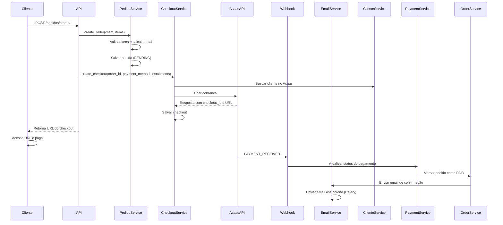
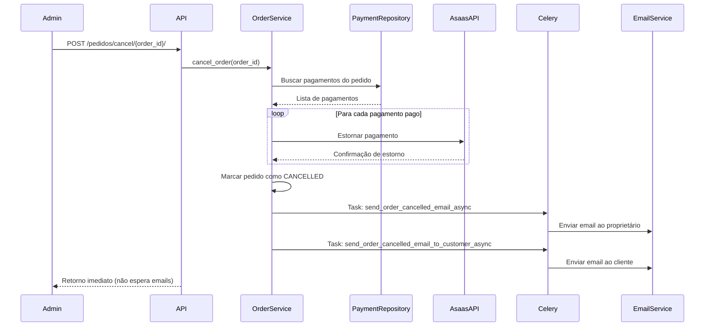
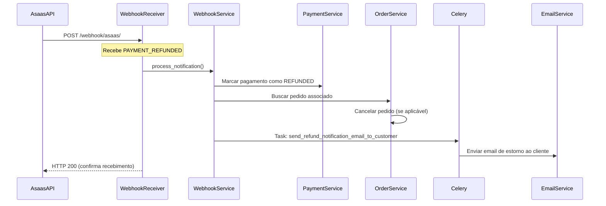

# Documentação Técnica - Fluxo Completo da API de Pagamento e Frete

## Índice

1. [Visão Geral](#visão-geral)
2. [Arquitetura do Sistema](#arquitetura-do-sistema)
3. [Fluxos Principais](#fluxos-principais)
4. [Integração com Asaas](#integração-com-asaas)
5. [Sistema de Webhooks](#sistema-de-webhooks)
6. [Processamento Assíncrono com Celery](#processamento-assíncrono-com-celery)
7. [Modelagem de Dados](#modelagem-de-dados)
8. [Endpoints da API](#endpoints-da-api)

---

## Visão Geral

Esta API gerencia o processo completo de pedidos, pagamentos e frete, integrando com o gateway de pagamento Asaas. O sistema foi desenvolvido utilizando:

- **Framework**: Django 5.2 com Django REST Framework
- **Banco de Dados**: PostgreSQL 17
- **Cache/Message Broker**: Redis 7
- **Processamento Assíncrono**: Celery 5.3
- **Gateway de Pagamento**: Asaas API

### Principais Funcionalidades

1. Gestão de usuários e clientes
2. Criação e gestão de pedidos
3. Processamento de pagamentos (PIX e Cartão de Crédito)
4. Pagamentos parcelados
5. Webhooks para notificações de pagamento
6. Cancelamento de pedidos com estorno automático
7. Sistema de notificações por email assíncronas

---

## Arquitetura do Sistema

### Estrutura de Pastas (Clean Architecture)

```
src/
├── api_pagamento_frete/          # Configurações principais do Django
│   ├── settings.py               # Configurações e variáveis de ambiente
│   ├── celery.py                 # Configuração do Celery
│   └── urls.py                   # Roteamento principal
├── modules/
│   ├── usuario/                  # Módulo de usuários
│   │   ├── domain/               # Regras de negócio
│   │   ├── application/          # Casos de uso
│   │   └── adapters/             # Persistência
│   ├── cliente/                  # Módulo de clientes
│   ├── pedido/                   # Módulo de pedidos
│   ├── pagamento/                # Módulo de pagamentos
│   ├── webhook/                  # Processamento de webhooks
│   ├── checkout/                 # Gerenciamento de checkouts
│   └── email/                    # Serviço de emails
│       ├── domain/services/      # Lógica de negócio
│       └── tasks.py              # Tasks Celery
└── manage.py
```

### Princípios de Design

- **Clean Architecture**: Separação clara entre domínio, aplicação e infraestrutura
- **Repository Pattern**: Abstração da camada de persistência
- **Dependency Injection**: Inversão de dependências
- **Single Responsibility**: Cada módulo tem uma responsabilidade única

---

## Fluxos Principais

### 1. Fluxo de Criação de Pedido com Pagamento



### 2. Fluxo de Pagamento Parcelado

```
1. Cliente solicita pagamento parcelado
2. Checkout é criado com número de parcelas
3. Asaas processa a primeira parcela
4. Webhook PAYMENT_RECEIVED é recebido para cada parcela
5. Sistema verifica se todas as parcelas foram pagas
6. Quando completar, pedido é marcado como PAID
7. Email de confirmação é enviado
```

### 3. Fluxo de Cancelamento de Pedido



### 4. Fluxo de Webhook de Estorno (PAYMENT_REFUNDED)



---

## Integração com Asaas

### Configuração

```python
# settings.py
ASAAS_API_URL = os.getenv('ASAAS_API_URL', 'https://api-sandbox.asaas.com/v3')
ASAAS_API_TOKEN = os.getenv('ASAAS_API_TOKEN')
ASAAS_ENVIRONMENT = os.getenv('ASAAS_ENVIRONMENT', 'sandbox')
```

### Endpoints Utilizados

#### 1. Criação de Cliente
```
POST /customers
Content-Type: application/json

{
  "name": "Nome do Cliente",
  "cpfCnpj": "12345678900",
  "mobilePhone": "11987654321",
  "address": "Rua Exemplo",
  "addressNumber": "123",
  "complement": "Apto 45",
  "province": "Centro",
  "postalCode": "01234567",
  "city": "São Paulo",
  "state": "SP",
  "email": "cliente@email.com"
}

Response:
{
  "object": "customer",
  "id": "cus_...",
  "dateCreated": "2024-01-01",
  ...
}
```

#### 2. Criação de Cobrança (PIX/Boleto)
```
POST /payments
{
  "customer": "cus_...",
  "billingType": "PIX",
  "value": 100.00,
  "dueDate": "2024-01-15",
  "description": "Pedido #123",
  "externalReference": "ORD_20240101123456_ABC123"
}

Response:
{
  "object": "payment",
  "id": "pay_...",
  "status": "PENDING",
  "value": 100.00,
  "dueDate": "2024-01-15",
  "billingType": "PIX",
  "pixQrCodeId": "qr_...",
  "pixQrCodeBase64": "...",
  "pixCopiaECola": "...",
  ...
}
```

#### 3. Criação de Cobrança Parcelada (Cartão)
```
POST /payments
{
  "customer": "cus_...",
  "billingType": "CREDIT_CARD",
  "value": 300.00,
  "dueDate": "2024-01-15",
  "installmentCount": 3,
  "installmentValue": 100.00,
  "description": "Pedido #123 - Parcelado 3x",
  "externalReference": "ORD_20240101123456_ABC123",
  "creditCard": {
    "holderName": "Nome Completo",
    "number": "4111111111111111",
    "expiryMonth": "12",
    "expiryYear": "2025",
    "ccv": "123"
  },
  "creditCardHolderInfo": {
    "name": "Nome Completo",
    "email": "cliente@email.com",
    "cpfCnpj": "12345678900",
    "postalCode": "01234567",
    "addressNumber": "123",
    "phone": "11987654321"
  }
}

Response:
{
  "object": "payment",
  "id": "pay_...",
  "status": "CONFIRMED",
  "installment": "ins_...",
  "installmentCount": 3,
  "installmentValue": 100.00,
  ...
}
```

#### 4. Estorno de Pagamento
```
POST /payments/{payment_id}/refund
{
  "value": 100.00,
  "description": "Estorno por cancelamento do pedido"
}

Response:
{
  "object": "refund",
  "id": "ref_...",
  "dateCreated": "2024-01-10",
  "status": "PENDING",
  "value": 100.00,
  ...
}
```

### Sincronização de Dados

O sistema mantém referências bidirecionais com o Asaas:

- **Cliente**: `clients.asaas_id` → ID do cliente no Asaas
- **Pagamento**: `payments.asaas_id` → ID do pagamento no Asaas
- **Checkout**: `checkouts.asaas_checkout_id` → ID do checkout no Asaas

---

## Sistema de Webhooks

### Eventos Processados

| Evento | Descrição | Ação do Sistema |
|--------|-----------|-----------------|
| `PAYMENT_CREATED` | Pagamento criado no Asaas | Registro do evento |
| `PAYMENT_CONFIRMED` | Pagamento confirmado | Atualizar status do pagamento |
| `PAYMENT_RECEIVED` | Pagamento recebido | Marcar pagamento como pago e atualizar pedido |
| `PAYMENT_OVERDUE` | Pagamento vencido | Marcar como vencido |
| `PAYMENT_DELETED` | Pagamento deletado | Marcar como falhado |
| `PAYMENT_REFUNDED` | Pagamento estornado | Cancelar pedido e notificar cliente |

### Endpoint de Webhook

```
POST /webhook/asaas/
Content-Type: application/json

{
  "event": "PAYMENT_RECEIVED",
  "payment": {
    "id": "pay_...",
    "customer": "cus_...",
    "subscription": "sub_...",
    "installment": "ins_...",
    "value": 100.00,
    "netValue": 97.00,
    "status": "RECEIVED",
    "billingType": "PIX",
    "externalReference": "ORD_20240101123456_ABC123",
    ...
  }
}
```

### Processamento de Webhooks

```python
class WebhookNotificationService:
    def process_notification(self, notification):
        # Verifica se já foi processado
        if notification.processed:
            return {'message': 'Already processed'}
        
        # Busca o pagamento relacionado
        payment = self._find_payment(notification)
        
        # Processa conforme o evento
        if notification.event == 'PAYMENT_RECEIVED':
            return self._process_payment_received(notification)
        elif notification.event == 'PAYMENT_REFUNDED':
            return self._process_payment_refunded(notification)
        # ... outros eventos
        
        # Marca como processado
        notification.mark_as_processed()
        self.notification_repository.save(notification)
```

---

## Processamento Assíncrono com Celery

### Configuração

```python
# settings.py
CELERY_BROKER_URL = f"redis://{REDIS_HOST}:{REDIS_PORT}/1"
CELERY_RESULT_BACKEND = f"redis://{REDIS_HOST}:{REDIS_PORT}/2"
CELERY_TASK_SERIALIZER = 'json'
CELERY_RESULT_SERIALIZER = 'json'
CELERY_TIMEZONE = 'America/Sao_Paulo'
```

### Tasks Assíncronas

#### 1. Email de Pedido Cancelado ao Proprietário
```python
@shared_task(name='send_order_cancelled_email')
def send_order_cancelled_email_async(order_data, client_data, refund_info):
    # Converte dados serializados para entidades
    client = _deserialize_client(client_data)
    order = _deserialize_order(order_data, client)
    
    # Envia email
    email_service = EmailService()
    return email_service.send_order_cancelled_email(order, client, refund_info)
```

#### 2. Email de Pedido Cancelado ao Cliente
```python
@shared_task(name='send_order_cancelled_email_to_customer')
def send_order_cancelled_email_to_customer_async(order_data, client_data):
    client = _deserialize_client(client_data)
    order = _deserialize_order(order_data, client)
    
    email_service = EmailService()
    return email_service.send_order_cancelled_email_to_customer(order, client)
```

#### 3. Email de Estorno ao Cliente
```python
@shared_task(name='send_refund_notification_email_to_customer')
def send_refund_notification_email_to_customer_async(order_data, client_data, payment_info):
    client = _deserialize_client(client_data)
    order = _deserialize_order(order_data, client)
    
    email_service = EmailService()
    return email_service.send_refund_notification_email_to_customer(order, client, payment_info)
```

### Chamada de Tasks

```python
# order_service.py
def cancel_order(self, order_id):
    # ... lógica de cancelamento
    
    # Serializa dados
    order_data = self._serialize_order(updated_order)
    client_data = self._serialize_client(updated_order.client)
    
    # Envia tasks assíncronas (não bloqueia)
    send_order_cancelled_email_async.delay(order_data, client_data, refund_results)
    send_order_cancelled_email_to_customer_async.delay(order_data, client_data)
    
    # Retorna imediatamente
    return {'order_id': order.id, 'status': 'CANCELLED'}
```

### Benefícios

- **Performance**: API responde em <1s vs ~10s com emails síncronos
- **Escalabilidade**: Tasks podem ser distribuídas entre múltiplos workers
- **Resiliência**: Falhas no email não afetam o processo principal
- **Monitoramento**: Celery Flower permite monitorar execução das tasks

---

## Modelagem de Dados

### Modelo de Pedido (Order)

```sql
CREATE TABLE orders (
    id UUID PRIMARY KEY,
    client_id UUID REFERENCES clients(id),
    subtotal DECIMAL(10,2),
    total DECIMAL(10,2),
    status VARCHAR(50), -- PENDING, CONFIRMED, PAID, PREPARING, CANCELLED
    external_reference VARCHAR(100) UNIQUE,
    notes TEXT,
    created_at TIMESTAMP,
    updated_at TIMESTAMP,
    confirmed_at TIMESTAMP
);

-- Itens do pedido
CREATE TABLE order_items (
    id UUID PRIMARY KEY,
    order_id UUID REFERENCES orders(id),
    product_id VARCHAR(100),
    product_name VARCHAR(255),
    quantity INTEGER,
    unit_price DECIMAL(10,2),
    total_price DECIMAL(10,2)
);
```

### Modelo de Pagamento (Payment)

```sql
CREATE TABLE payments (
    id UUID PRIMARY KEY,
    order_id UUID REFERENCES orders(id),
    asaas_id VARCHAR(100), -- ID no Asaas
    value DECIMAL(10,2),
    payment_method VARCHAR(50), -- PIX, BOLETO, CREDIT_CARD
    status VARCHAR(50), -- PENDING, PAID, RECEIVED, OVERDUE, REFUNDED
    installments INTEGER,
    installment_id VARCHAR(100), -- ID da parcela no Asaas
    installment_number INTEGER,
    checkout_url TEXT,
    paid_at TIMESTAMP,
    created_at TIMESTAMP
);
```

### Modelo de Webhook (WebhookNotification)

```sql
CREATE TABLE webhook_notifications (
    id UUID PRIMARY KEY,
    event VARCHAR(100), -- PAYMENT_RECEIVED, PAYMENT_REFUNDED, etc
    payment_id VARCHAR(100),
    customer_id VARCHAR(100),
    status VARCHAR(50),
    value DECIMAL(10,2),
    external_reference VARCHAR(100),
    processed BOOLEAN DEFAULT FALSE,
    data JSONB, -- Dados brutos do webhook
    created_at TIMESTAMP
);
```

---

## Endpoints da API

### Autenticação

```
POST /usuarios/register/
POST /usuarios/login/
POST /usuarios/logout/
```

### Pedidos

```
POST   /pedidos/create/           # Criar pedido
GET    /pedidos/detail/{id}/      # Detalhes do pedido
POST   /pedidos/confirm/{id}/     # Confirmar pedido
POST   /pedidos/cancel/{id}/      # Cancelar pedido
GET    /pedidos/my-orders/        # Listar pedidos do cliente
```

### Checkout

```
POST   /checkout/create/          # Criar checkout
GET    /checkout/{id}/            # Detalhes do checkout
```

### Cliente

```
POST   /clientes/create/          # Criar cliente
GET    /clientes/{id}/            # Detalhes do cliente
POST   /clientes/sync-asaas/      # Sincronizar com Asaas
```

### Webhooks

```
POST   /webhook/asaas/            # Receber webhook do Asaas
```

---

## Considerações de Performance

### Otimizações Implementadas

1. **Processamento Assíncrono**: Emails enviados via Celery
2. **Cache Redis**: Sessões e dados temporários
3. **Índices de Banco**: External references únicas e foreign keys
4. **Lazy Loading**: Apenas dados necessários carregados
5. **Serialização Específica**: Apenas campos necessários expostos

### Métricas Esperadas

- **Criação de pedido**: <500ms
- **Cancelamento de pedido**: <1s (sem esperar emails)
- **Processamento de webhook**: <500ms
- **Envio de email**: <5s (processado em background)

---

## Variáveis de Ambiente

```env
# Django
SECRET_KEY=your-secret-key
DEBUG=True
ALLOWED_HOSTS=localhost,127.0.0.1

# Database
POSTGRES_DB=api_pagamento
POSTGRES_USER=postgres
POSTGRES_PASSWORD=postgres
POSTGRES_HOST=db
POSTGRES_PORT=5432

# Redis
REDIS_HOST=redis
REDIS_PORT=6379

# Asaas
ASAAS_API_URL=https://api-sandbox.asaas.com/v3
ASAAS_API_TOKEN=your-api-token
ASAAS_ENVIRONMENT=sandbox

# Email
OWNER_EMAIL=owner@example.com
DEFAULT_FROM_EMAIL=noreply@example.com
EMAIL_BACKEND=django.core.mail.backends.smtp.EmailBackend
EMAIL_HOST=smtp.gmail.com
EMAIL_PORT=587
EMAIL_USE_TLS=True
EMAIL_HOST_USER=your-email@gmail.com
EMAIL_HOST_PASSWORD=your-app-password

# Configurações
DAYS_TO_CANCEL=2
PORT=8000
```

---

## Docker Compose

```yaml
services:
  web:
    # API Django
  celery:
    # Worker Celery para emails
  celery-beat:
    # Scheduler Celery (opcional)
  db:
    # PostgreSQL
  redis:
    # Redis
  ngrok:
    # Tunelamento para webhooks
```

---

## Fluxo Completo - Exemplo Prático

### Cenário: Cliente cria pedido e paga com PIX

1. **Cliente autentica** → Obtém token JWT
2. **Cria pedido** → POST `/pedidos/create/`
   - Sistema valida itens
   - Calcula total
   - Cria pedido com status PENDING
3. **Cria checkout** → POST `/checkout/create/`
   - Busca ou cria cliente no Asaas
   - Cria cobrança PIX no Asaas
   - Retorna URL e QR Code PIX
4. **Cliente paga** → Via PIX
5. **Webhook recebido** → POST `/webhook/asaas/`
   - Event: PAYMENT_RECEIVED
   - Sistema atualiza pagamento
   - Marca pedido como PAID
   - Envia email de confirmação (assíncrono)
6. **Pedido confirmado** → Sistema está pronto para envio

### Cenário: Cancelamento com estorno

1. **Admin cancela pedido** → POST `/pedidos/cancel/{id}/`
2. **Sistema busca pagamentos** → Pagamento está PAID
3. **Estorna no Asaas** → POST `/payments/{id}/refund`
4. **Marca pedido como CANCELLED**
5. **Envia emails** → Via Celery (não bloqueia)
   - Email ao proprietário (com detalhes)
   - Email ao cliente (notificação)
6. **Cliente recebe estorno** → Em até 3 dias úteis
7. **Webhook PAYMENT_REFUNDED** → Confirma estorno
8. **Sistema envia email de estorno** → Ao cliente

---

## Segurança

### Implementado

- ✅ Autenticação JWT com tokens temporários
- ✅ Blacklist de tokens inválidos
- ✅ Validação de dados de entrada
- ✅ Sanitização de inputs
- ✅ HTTPS em produção (via proxy reverso)
- ✅ Variáveis sensíveis em variáveis de ambiente
- ✅ Rate limiting (recomendado: django-ratelimit)

## Versionamento

### Versão Atual: 1.0.0

- Sistema completo de pedidos
- Integração com Asaas
- Webhooks de pagamento
- Emails assíncronos com Celery
- Cancelamento com estorno automático

---

## Referências

- [Django Documentation](https://docs.djangoproject.com/)
- [Django REST Framework](https://www.django-rest-framework.org/)
- [Celery Documentation](https://docs.celeryproject.org/)
- [Asaas API Documentation](https://docs.asaas.com/)
- [PostgreSQL Documentation](https://www.postgresql.org/docs/)

---

## Suporte

Para dúvidas técnicas ou problemas:
- Consulte os logs: `docker-compose logs -f`
- Verifique status dos serviços: `docker-compose ps`
- Revise a configuração no `settings.py`
- Consulte a documentação do Asaas para integração
