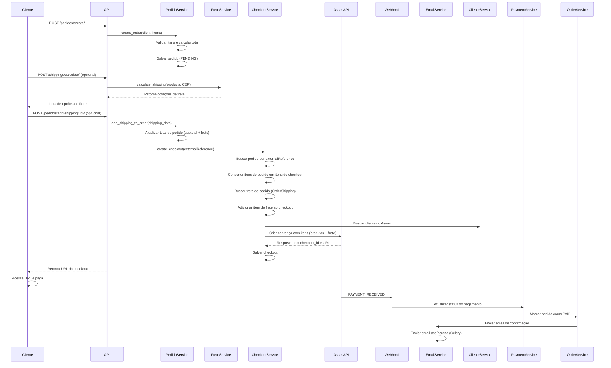
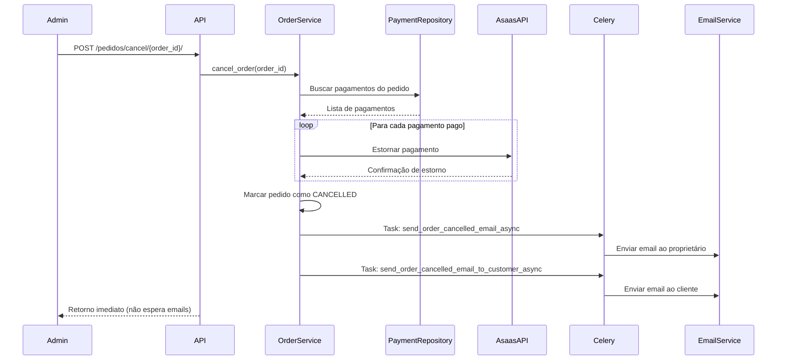
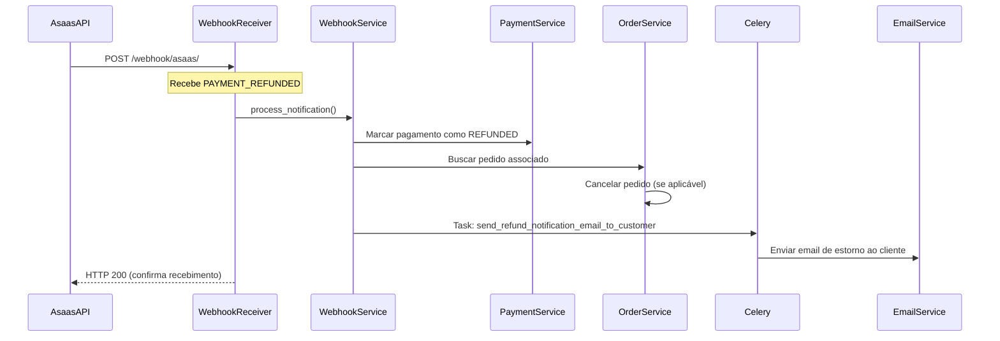
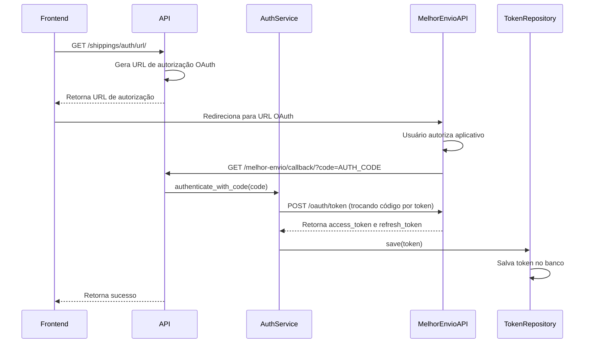
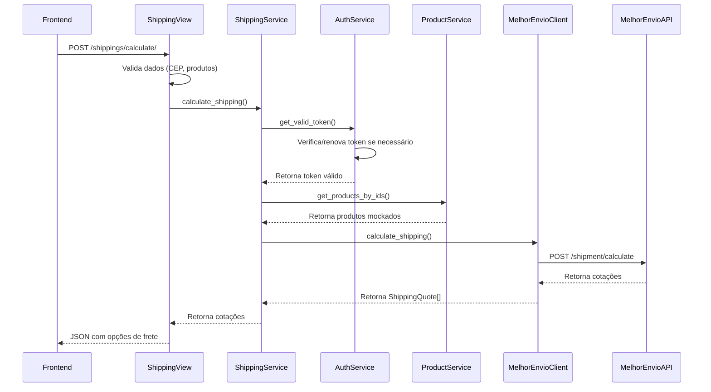

# Documentação Técnica - Fluxo Completo da API de Pagamento e Frete

## Índice

1. [Visão Geral](#visão-geral)
2. [Arquitetura do Sistema](#arquitetura-do-sistema)
3. [Fluxos Principais](#fluxos-principais)
4. [Integração com Asaas](#integração-com-asaas)
5. [Sistema de Webhooks](#sistema-de-webhooks)
6. [Sistema de Emails](#sistema-de-emails)
7. [Processamento Assíncrono com Celery](#processamento-assíncrono-com-celery)
8. [Integração com Melhor Envio](#integração-com-melhor-envio)
9. [Transações e Consistência de Dados](#transações-e-consistência-de-dados)
10. [Modelagem de Dados](#modelagem-de-dados)
11. [Endpoints da API](#endpoints-da-api)
12. [Considerações de Performance](#considerações-de-performance)

---

## Visão Geral

Esta API gerencia o processo completo de pedidos, pagamentos e frete, integrando com o gateway de pagamento Asaas. O sistema foi desenvolvido utilizando:

- **Framework**: Django 5.2 com Django REST Framework
- **Banco de Dados**: PostgreSQL 17
- **Cache/Message Broker**: Redis 7
- **Processamento Assíncrono**: Celery 5.3
- **Gateway de Pagamento**: Asaas API

### Principais Funcionalidades

1. Gestão de usuários e clientes
2. Criação e gestão de pedidos
3. Processamento de pagamentos (PIX e Cartão de Crédito)
4. Pagamentos parcelados
5. Webhooks para notificações de pagamento
6. Cancelamento de pedidos com estorno automático
7. Sistema de notificações por email assíncronas (texto formatado)
8. Integração com Melhor Envio para cálculo de frete
9. Autenticação OAuth com Melhor Envio
10. Gestão de tokens OAuth com renovação automática

---

## Arquitetura do Sistema

### Estrutura de Pastas (Clean Architecture)

```
src/
├── api_pagamento_frete/          # Configurações principais do Django
│   ├── settings.py               # Configurações e variáveis de ambiente
│   ├── celery.py                 # Configuração do Celery
│   └── urls.py                   # Roteamento principal
├── modules/
│   ├── usuario/                  # Módulo de usuários
│   │   ├── domain/               # Regras de negócio
│   │   ├── application/          # Casos de uso
│   │   └── adapters/             # Persistência
│   ├── cliente/                  # Módulo de clientes
│   ├── pedido/                   # Módulo de pedidos
│   ├── pagamento/                # Módulo de pagamentos
│   ├── webhook/                  # Processamento de webhooks
│   ├── checkout/                 # Gerenciamento de checkouts
│   ├── frete/                    # Módulo de frete (Melhor Envio)
│   │   ├── domain/               # Entidades e serviços
│   │   │   ├── entities/         # Token, Product, ShippingQuote
│   │   │   ├── services/         # Auth, Shipping, ProductMock
│   │   │   └── repositories/     # Interfaces de repositório
│   │   ├── application/          # Casos de uso e views
│   │   └── adapters/             # Cliente HTTP, persistência
│   │       ├── external/         # Cliente Melhor Envio
│   │       └── persistence/      # Repositórios Django
│   └── email/                    # Serviço de emails
│       ├── domain/services/      # Lógica de negócio
│       └── tasks.py              # Tasks Celery
└── manage.py
```

### Princípios de Design

- **Clean Architecture**: Separação clara entre domínio, aplicação e infraestrutura
- **Repository Pattern**: Abstração da camada de persistência
- **Dependency Injection**: Inversão de dependências
- **Single Responsibility**: Cada módulo tem uma responsabilidade única

---

## Fluxos Principais

### 1. Fluxo de Criação de Pedido com Pagamento



### 2. Fluxo de Pagamento Parcelado

```
1. Cliente solicita pagamento parcelado
2. Checkout é criado com número de parcelas
3. Asaas processa a primeira parcela
4. Webhook PAYMENT_RECEIVED é recebido para cada parcela
5. Sistema verifica se todas as parcelas foram pagas
6. Quando completar, pedido é marcado como PAID
7. Email de confirmação é enviado
```

### 3. Fluxo de Cancelamento de Pedido



### 4. Fluxo de Webhook de Estorno (PAYMENT_REFUNDED)



---

## Integração com Asaas

### Configuração

```python
# settings.py
ASAAS_API_URL = os.getenv('ASAAS_API_URL', 'https://api-sandbox.asaas.com/v3')
ASAAS_API_TOKEN = os.getenv('ASAAS_API_TOKEN')
ASAAS_ENVIRONMENT = os.getenv('ASAAS_ENVIRONMENT', 'sandbox')
```

### Endpoints Utilizados

#### 1. Criação de Cliente
```
POST /customers
Content-Type: application/json

{
  "name": "Nome do Cliente",
  "cpfCnpj": "12345678900",
  "mobilePhone": "11987654321",
  "address": "Rua Exemplo",
  "addressNumber": "123",
  "complement": "Apto 45",
  "province": "Centro",
  "postalCode": "01234567",
  "city": "São Paulo",
  "state": "SP",
  "email": "cliente@email.com"
}

Response:
{
  "object": "customer",
  "id": "cus_...",
  "dateCreated": "2024-01-01",
  ...
}
```

#### 2. Criação de Cobrança (PIX/Boleto)
```
POST /payments
{
  "customer": "cus_...",
  "billingType": "PIX",
  "value": 100.00,
  "dueDate": "2024-01-15",
  "description": "Pedido #123",
  "externalReference": "ORD_20240101123456_ABC123"
}

Response:
{
  "object": "payment",
  "id": "pay_...",
  "status": "PENDING",
  "value": 100.00,
  "dueDate": "2024-01-15",
  "billingType": "PIX",
  "pixQrCodeId": "qr_...",
  "pixQrCodeBase64": "...",
  "pixCopiaECola": "...",
  ...
}
```

#### 3. Criação de Cobrança Parcelada (Cartão)
```
POST /payments
{
  "customer": "cus_...",
  "billingType": "CREDIT_CARD",
  "value": 300.00,
  "dueDate": "2024-01-15",
  "installmentCount": 3,
  "installmentValue": 100.00,
  "description": "Pedido #123 - Parcelado 3x",
  "externalReference": "ORD_20240101123456_ABC123",
  "creditCard": {
    "holderName": "Nome Completo",
    "number": "4111111111111111",
    "expiryMonth": "12",
    "expiryYear": "2025",
    "ccv": "123"
  },
  "creditCardHolderInfo": {
    "name": "Nome Completo",
    "email": "cliente@email.com",
    "cpfCnpj": "12345678900",
    "postalCode": "01234567",
    "addressNumber": "123",
    "phone": "11987654321"
  }
}

Response:
{
  "object": "payment",
  "id": "pay_...",
  "status": "CONFIRMED",
  "installment": "ins_...",
  "installmentCount": 3,
  "installmentValue": 100.00,
  ...
}
```

#### 4. Estorno de Pagamento
```
POST /payments/{payment_id}/refund
{
  "value": 100.00,
  "description": "Estorno por cancelamento do pedido"
}

Response:
{
  "object": "refund",
  "id": "ref_...",
  "dateCreated": "2024-01-10",
  "status": "PENDING",
  "value": 100.00,
  ...
}
```

### Sincronização de Dados

O sistema mantém referências bidirecionais com o Asaas:

- **Cliente**: `clients.asaas_id` → ID do cliente no Asaas
- **Pagamento**: `payments.asaas_id` → ID do pagamento no Asaas
- **Checkout**: `checkouts.asaas_checkout_id` → ID do checkout no Asaas

---

## Sistema de Webhooks

### Eventos Processados

| Evento | Descrição | Ação do Sistema |
|--------|-----------|-----------------|
| `PAYMENT_CREATED` | Pagamento criado no Asaas | Registro do evento |
| `PAYMENT_CONFIRMED` | Pagamento confirmado | Atualizar status do pagamento |
| `PAYMENT_RECEIVED` | Pagamento recebido | Marcar pagamento como pago e atualizar pedido |
| `PAYMENT_OVERDUE` | Pagamento vencido | Marcar como vencido |
| `PAYMENT_DELETED` | Pagamento deletado | Marcar como falhado |
| `PAYMENT_REFUNDED` | Pagamento estornado | Cancelar pedido e notificar cliente |

### Endpoint de Webhook

```
POST /webhook/asaas/
Content-Type: application/json

{
  "event": "PAYMENT_RECEIVED",
  "payment": {
    "id": "pay_...",
    "customer": "cus_...",
    "subscription": "sub_...",
    "installment": "ins_...",
    "value": 100.00,
    "netValue": 97.00,
    "status": "RECEIVED",
    "billingType": "PIX",
    "externalReference": "ORD_20240101123456_ABC123",
    ...
  }
}
```

### Processamento de Webhooks

```python
class WebhookNotificationService:
    def process_notification(self, notification):
        # Verifica se já foi processado
        if notification.processed:
            return {'message': 'Already processed'}
        
        # Busca o pagamento relacionado
        payment = self._find_payment(notification)
        
        # Processa conforme o evento
        if notification.event == 'PAYMENT_RECEIVED':
            return self._process_payment_received(notification)
        elif notification.event == 'PAYMENT_REFUNDED':
            return self._process_payment_refunded(notification)
        # ... outros eventos
        
        # Marca como processado
        notification.mark_as_processed()
        self.notification_repository.save(notification)
```

---

## Sistema de Emails

### Visão Geral

O sistema utiliza emails em formato texto (plain text) gerados automaticamente pelo backend. Todos os emails são enviados de forma assíncrona através de tasks Celery para não bloquear as operações principais da API.

### Tipos de Email

#### 1. Email de Pedido Confirmado
- **Destinatário**: Proprietário do sistema (`OWNER_EMAIL`)
- **Assunto**: "Novo Pedido Confirmado - {external_reference}"
- **Conteúdo**: Informações completas do pedido, cliente, produtos e endereço de entrega
- **Enviado quando**: Pagamento é confirmado via webhook `PAYMENT_RECEIVED`

#### 2. Email de Pedido Cancelado ao Proprietário
- **Destinatário**: Proprietário do sistema (`OWNER_EMAIL`)
- **Assunto**: "Pedido Cancelado - {external_reference}"
- **Conteúdo**: Detalhes do cancelamento, informações do cliente, produtos e ações necessárias
- **Enviado quando**: Pedido é cancelado via `POST /pedidos/cancel/{id}/`

#### 3. Email de Pedido Cancelado ao Cliente
- **Destinatário**: Email do cliente cadastrado
- **Assunto**: "Pedido Cancelado - {external_reference}"
- **Conteúdo**: Notificação amigável sobre o cancelamento e informações sobre estorno
- **Enviado quando**: Pedido é cancelado via `POST /pedidos/cancel/{id}/`

#### 4. Email de Estorno Processado
- **Destinatário**: Email do cliente cadastrado
- **Assunto**: "Estorno Processado - Pedido {external_reference}"
- **Conteúdo**: Confirmação de estorno, valor estornado e informações sobre crédito
- **Enviado quando**: Webhook `PAYMENT_REFUNDED` é processado

### Formato dos Emails

Os emails são gerados em texto simples formatado, utilizando caracteres especiais para organização visual (━, ✓, ⚠️, etc.). O conteúdo inclui:

- Informações do pedido (ID, data, valor, status)
- Detalhes dos produtos/itens
- Informações do cliente (nome, CPF, contato, endereço)
- Instruções ou ações necessárias
- Observações relevantes

---

## Integração com Melhor Envio

### Visão Geral

O sistema integra com a API do Melhor Envio para cálculo de frete de produtos. A integração utiliza OAuth 2.0 para autenticação, permitindo renovação automática de tokens através de refresh tokens.

### Arquitetura do Módulo de Frete

O módulo `frete` segue Clean Architecture com as seguintes camadas:

- **Domain**: Entidades (`Token`, `Product`, `ShippingQuote`), serviços de negócio e interfaces de repositório
- **Application**: Casos de uso e views da API REST
- **Adapters**: Cliente HTTP para API do Melhor Envio e persistência usando Django ORM

### Configuração

```python
# settings.py
MELHOR_ENVIO_CLIENT_ID = os.getenv('MELHOR_ENVIO_CLIENT_ID')
MELHOR_ENVIO_CLIENT_SECRET = os.getenv('MELHOR_ENVIO_CLIENT_SECRET')
MELHOR_ENVIO_REDIRECT_URI = os.getenv('MELHOR_ENVIO_REDIRECT_URI')
MELHOR_ENVIO_ENVIRONMENT = os.getenv('MELHOR_ENVIO_ENVIRONMENT', 'sandbox')  # sandbox ou production
MELHOR_ENVIO_ACCESS_TOKEN = os.getenv('ACESS_TOKEN_MELHOR_ENVIO')  # Token manual (opcional)
OWNER_CEP = os.getenv('OWNER_CEP')  # CEP de origem para cálculos de frete
```

### Autenticação OAuth 2.0

#### Fluxo de Autenticação



#### Endpoints de Autenticação

##### 1. Obter URL de Autorização
```
GET /shippings/auth/url/
Query params (opcionais):
- redirect_uri: URI de redirecionamento
- state: String para prevenção de CSRF

Response:
{
  "auth_url": "https://sandbox.melhorenvio.com.br/oauth/authorize?client_id=...&redirect_uri=...&response_type=code&scope=shipping-calculate shipping-companies",
  "instructions": "Redirecione o usuário para esta URL..."
}
```

##### 2. Callback OAuth (Automático)
```
GET /melhor-envio/callback/?code=AUTH_CODE&state=...

Response:
{
  "success": true,
  "message": "Autenticação realizada com sucesso! Token salvo automaticamente.",
  "token": {
    "access_token": "...",
    "refresh_token": "...",
    "expires_in": 2592000,
    "token_type": "Bearer"
  },
  "saved": true,
  "token_preview": "eyJ0e...nTKfE"
}
```

##### 3. Autenticação Manual (POST)
```
POST /shippings/auth/
Content-Type: application/json

{
  "authorization_code": "AUTH_CODE_FROM_OAUTH",
  "redirect_uri": "https://seu-site.com/callback"  // opcional
}

Response:
{
  "access_token": "...",
  "refresh_token": "...",
  "expires_in": 2592000,
  "token_type": "Bearer"
}
```

##### 4. Renovar Token
```
POST /shippings/auth/refresh/

Response:
{
  "access_token": "...",
  "refresh_token": "...",
  "expires_in": 2592000,
  "token_type": "Bearer"
}
```

##### 5. Status do Token (Debug)
```
GET /shippings/auth/status/

Response:
{
  "token_in_env": true,
  "token_in_db": true,
  "token_valid": true,
  "token_source": "oauth",
  "can_refresh": true,
  "token_db_details": {
    "has_access_token": true,
    "has_refresh_token": true,
    "access_token_length": 1701,
    "refresh_token_length": 256,
    "expires_in": 2592000,
    "created_at": "2025-11-04T19:39:19.010712",
    "is_expired": false,
    "source": "oauth"
  },
  "environment": "sandbox",
  "client_id_configured": true,
  "client_secret_configured": true,
  "redirect_uri_configured": true
}
```

### Gerenciamento de Tokens

#### Prioridade de Tokens

1. **Token OAuth do Banco**: Token gerado via OAuth e salvo no banco de dados (prioridade máxima)
   - Se o token existir no banco e não estiver expirado, será usado
   - Tokens OAuth são renovados automaticamente quando expirados (se tiverem refresh_token)
2. **Token do `.env`** (`ACESS_TOKEN_MELHOR_ENVIO`): Fallback quando não há token no banco
   - Usado apenas se não existir token no banco de dados ou se o token do banco estiver expirado
   - Útil para testes rápidos ou configuração inicial

#### Ciclo de Vida do Token

```python
class TokenRepositoryDjango:
    def get_latest(self) -> Optional[Token]:
        # 1. Primeiro tenta buscar do banco de dados
        try:
            model = MelhorEnvioTokenModel.objects.latest('created_at')
            if not model.is_expired():
                return Token(...)  # Retorna token do banco
        except MelhorEnvioTokenModel.DoesNotExist:
            pass
        
        # 2. Se não encontrou no banco, busca do .env (fallback)
        token_env = os.getenv('ACESS_TOKEN_MELHOR_ENVIO')
        if token_env:
            return Token(...)  # Retorna token do .env
        
        return None

class MelhorEnvioAuthService:
    def get_valid_token(self) -> Optional[Token]:
        # 1. Busca token (prioriza banco, depois .env)
        token = self.token_repository.get_latest()
        
        # 2. Se token do .env (sem refresh_token), retorna (sempre válido)
        if token and not token.refresh_token:
            return token
        
        # 3. Se token OAuth expirado, renova automaticamente
        if token and token.is_expired():
            token = self.refresh_access_token()
        
        return token
```

### Cálculo de Frete

#### Endpoint de Cálculo

```
POST /shippings/calculate/
Content-Type: application/json

{
  "to_postal_code": "01018020",  // CEP de destino (obrigatório)
  "products": [                   // Lista de produtos (obrigatório)
    {
      "product_id": "1",
      "quantity": 2
    },
    {
      "product_id": "2",
      "quantity": 1
    }
  ],
  "from_postal_code": "96020360",  // CEP de origem (opcional, usa OWNER_CEP se não informado)
  "receipt": false,                 // Recebimento (opcional)
  "own_hand": false,                // Mão própria (opcional)
  "services": "1,2,18"              // IDs de serviços específicos (opcional)
}

Response:
{
  "quotes": [
    {
      "id": 1,
      "name": "PAC",
      "price": "46.02",
      "custom_price": "46.02",
      "currency": "R$",
      "delivery_time": 8,
      "custom_delivery_time": 8,
      "company": {
        "id": 1,
        "name": "Correios",
        "picture": "https://sandbox.melhorenvio.com.br/images/shipping-companies/correios.png"
      },
      "final_price": 46.02,
      "final_delivery_time": 8
    },
    // ... outras opções
  ],
  "count": 5
}
```

#### Fluxo de Cálculo de Frete



#### Produtos Mockados

Os produtos são mockados usando o `ProdutoRepository` do sistema. O frontend envia apenas IDs e quantidades:

```python
# Produtos disponíveis (mockados)
products = {
    "1": {
        "id": "1",
        "name": "Produto 1",
        "weight": 0.5,  # kg
        "width": 20,    # cm
        "height": 10,   # cm
        "length": 30    # cm
    },
    # ... outros produtos
}
```

### Modelagem de Dados - Frete

```sql
-- Tokens OAuth do Melhor Envio
CREATE TABLE melhor_envio_token (
    id SERIAL PRIMARY KEY,
    access_token TEXT UNIQUE NOT NULL,
    refresh_token TEXT UNIQUE,
    expires_in INTEGER DEFAULT 2592000,
    token_type VARCHAR(50) DEFAULT 'Bearer',
    created_at TIMESTAMP NOT NULL,
    updated_at TIMESTAMP NOT NULL
);
```

### Tratamento de Erros

#### Erros Comuns

1. **`invalid_client`**: Credenciais OAuth incorretas
   - **Solução**: Verificar `MELHOR_ENVIO_CLIENT_ID` e `MELHOR_ENVIO_CLIENT_SECRET` no `.env`

2. **`invalid_code`**: Código de autorização expirado ou inválido
   - **Solução**: Gerar novo código de autorização (códigos expiram rapidamente e só podem ser usados uma vez)

3. **`Unauthenticated (401)`**: Token inválido ou expirado
   - **Solução**: Renovar token via `/shippings/auth/refresh/` ou reautenticar

4. **Token sem refresh_token**: Token foi gerado manualmente
   - **Solução**: Autorizar via OAuth completo para obter refresh_token

### Ambientes

- **Sandbox**: `https://sandbox.melhorenvio.com.br`
- **Produção**: `https://melhorenvio.com.br` / `https://auth.melhorenvio.com.br` (OAuth)

### Variáveis de Ambiente - Melhor Envio

```env
# Melhor Envio OAuth
MELHOR_ENVIO_CLIENT_ID=seu_client_id_aqui
MELHOR_ENVIO_CLIENT_SECRET=seu_client_secret_aqui
MELHOR_ENVIO_REDIRECT_URI=https://seu-dominio.com/melhor-envio/callback/
MELHOR_ENVIO_ENVIRONMENT=sandbox  # ou production

# Token Manual (opcional - usado apenas como fallback quando não há token no banco)
# Prioridade: 1) Token OAuth do banco de dados, 2) Token do .env (fallback)
ACESS_TOKEN_MELHOR_ENVIO=seu_token_aqui

# CEP de origem (obrigatório para cálculos)
OWNER_CEP=00000000
```

### Segurança e Boas Práticas

1. **Não commitar credenciais**: Todas as credenciais devem estar no `.env`
2. **HTTPS obrigatório**: Use HTTPS em produção para callbacks OAuth
3. **Validação de redirect_uri**: O `redirect_uri` deve ser exatamente igual ao configurado no painel do Melhor Envio
4. **Tokens sensíveis**: Tokens OAuth são armazenados no banco e devem ser protegidos
5. **Renovação automática**: Sempre use OAuth completo (não tokens manuais) em produção para ter renovação automática

---

## Processamento Assíncrono com Celery

### Configuração

```python
# settings.py
CELERY_BROKER_URL = f"redis://{REDIS_HOST}:{REDIS_PORT}/1"
CELERY_RESULT_BACKEND = f"redis://{REDIS_HOST}:{REDIS_PORT}/2"
CELERY_TASK_SERIALIZER = 'json'
CELERY_RESULT_SERIALIZER = 'json'
CELERY_TIMEZONE = 'America/Sao_Paulo'
```

### Tasks Assíncronas de Email

#### 1. Email de Pedido Cancelado ao Proprietário
```python
@shared_task(name='send_order_cancelled_email', bind=True, max_retries=3, default_retry_delay=60)
def send_order_cancelled_email_async(self, order_data, client_data, refund_info):
    # Converte dados serializados para entidades
    client = _deserialize_client(client_data)
    order = _deserialize_order(order_data, client)
    
    # Envia email
    email_service = EmailService()
    result = email_service.send_order_cancelled_email(order, client, refund_info)
    
    # Retry automático em caso de falha
    if not result and self.request.retries < self.max_retries:
        raise self.retry(exc=ValueError("Email não foi enviado"))
    
    return result
```

#### 2. Email de Pedido Cancelado ao Cliente
```python
@shared_task(name='send_order_cancelled_email_to_customer', bind=True, max_retries=3, default_retry_delay=60)
def send_order_cancelled_email_to_customer_async(self, order_data, client_data):
    client = _deserialize_client(client_data)
    order = _deserialize_order(order_data, client)
    
    email_service = EmailService()
    return email_service.send_order_cancelled_email_to_customer(order, client)
```

#### 3. Email de Estorno ao Cliente
```python
@shared_task(name='send_refund_notification_email_to_customer', bind=True, max_retries=3, default_retry_delay=60)
def send_refund_notification_email_to_customer_async(self, order_data, client_data, payment_info):
    client = _deserialize_client(client_data)
    order = _deserialize_order(order_data, client)
    
    email_service = EmailService()
    return email_service.send_refund_notification_email_to_customer(order, client, payment_info)
```

### Chamada de Tasks

```python
# order_service.py
def cancel_order(self, order_id):
    # ... lógica de cancelamento e estorno
    
    with transaction.atomic():
        order.cancel()
        updated_order = self.order_repository.update(order)
        
        # Serializa dados para as tasks
        order_data = self._serialize_order(updated_order)
        client_data = self._serialize_client(updated_order.client)
        
        # Envia tasks assíncronas (não bloqueia a resposta)
        try:
            send_order_cancelled_email_async.delay(order_data, client_data, refund_results)
            send_order_cancelled_email_to_customer_async.delay(order_data, client_data)
        except Exception as e:
            # Se falhar ao agendar, tenta novamente após 2 segundos
            send_order_cancelled_email_async.apply_async(
                args=[order_data, client_data, refund_results],
                countdown=2
            )
            send_order_cancelled_email_to_customer_async.apply_async(
                args=[order_data, client_data],
                countdown=2
            )
    
    # Retorna imediatamente (não espera envio de email)
    return {'order_id': order.id, 'status': 'CANCELLED'}
```

### Tasks Assíncronas de Pagamento e Limpeza

#### 1. Limpeza de Checkouts Órfãos
```python
@shared_task(name='cleanup_orphaned_checkouts', bind=True, max_retries=3, default_retry_delay=300)
def cleanup_orphaned_checkouts_async(self, asaas_checkout_ids: List[str]) -> dict:
    """
    Task assíncrona para limpar checkouts órfãos no Asaas
    
    Usada quando uma operação falha após criar checkout no Asaas mas antes de salvar localmente.
    Sistema agenda esta task para limpar recursos órfãos no Asaas.
    """
    cleanup_service = CleanupService()
    result = cleanup_service.cleanup_orphaned_checkouts(asaas_checkout_ids)
    return result
```

**Uso:**
- Chamada automaticamente quando operação com Asaas falha após criar checkout
- Limpa checkouts criados no Asaas mas não salvos no banco local
- Previne acúmulo de recursos órfãos no gateway

#### 2. Reconciliação de Status de Checkout
```python
@shared_task(name='reconcile_checkout_status', bind=True, max_retries=3, default_retry_delay=300)
def reconcile_checkout_status_async(self, asaas_checkout_id: str) -> dict:
    """
    Task assíncrona para reconciliar status de um checkout
    
    Sincroniza o status de um checkout local com o status no Asaas.
    Útil para verificar inconsistências ou atualizar status manualmente.
    """
    cleanup_service = CleanupService()
    result = cleanup_service.reconcile_checkout_status(asaas_checkout_id)
    return result
```

**Uso:**
- Sincroniza status de checkout entre sistema local e Asaas
- Verifica inconsistências de status
- Atualiza status local baseado no status real no Asaas

### Configuração de Retry

**Tasks de Email:**
- **max_retries**: 3 tentativas
- **default_retry_delay**: 60 segundos entre tentativas
- **bind=True**: Permite acesso à task para retry manual

**Tasks de Pagamento/Limpeza:**
- **max_retries**: 3 tentativas
- **default_retry_delay**: 300 segundos (5 minutos) entre tentativas
- **bind=True**: Permite acesso à task para retry manual

### Benefícios

- **Performance**: API responde em <1s vs ~10s com emails síncronos
- **Escalabilidade**: Tasks podem ser distribuídas entre múltiplos workers
- **Resiliência**: Falhas no email não afetam o processo principal
- **Retry Automático**: Sistema tenta reenviar emails que falharam
- **Limpeza Automática**: Sistema limpa recursos órfãos automaticamente
- **Monitoramento**: Celery Flower permite monitorar execução das tasks

---

## Modelagem de Dados

Esta seção descreve todas as tabelas do banco de dados, seus campos, relacionamentos e índices.

### Tabela: `users` - Usuários do Sistema

Armazena informações dos usuários que utilizam a API.

```sql
CREATE TABLE users (
    id BIGSERIAL PRIMARY KEY,
    name VARCHAR(255) NOT NULL,
    email VARCHAR(255) NOT NULL UNIQUE,
    password VARCHAR(255) NOT NULL,  -- Hash da senha
    registration_date TIMESTAMP NOT NULL DEFAULT CURRENT_TIMESTAMP,
    active BOOLEAN NOT NULL DEFAULT TRUE
);

CREATE INDEX idx_users_email ON users(email);
CREATE INDEX idx_users_active ON users(active);
```

**Campos:**
- `id`: Identificador único (auto-incremento)
- `name`: Nome completo do usuário
- `email`: Email único (usado para login)
- `password`: Hash da senha (bcrypt)
- `registration_date`: Data de cadastro
- `active`: Indica se o usuário está ativo

**Relacionamentos:**
- OneToOne com `clients` (um usuário tem um cliente)

---

### Tabela: `password_reset_tokens` - Tokens de Reset de Senha

Armazena tokens para recuperação de senha.

```sql
CREATE TABLE password_reset_tokens (
    id BIGSERIAL PRIMARY KEY,
    user_id BIGINT NOT NULL REFERENCES users(id) ON DELETE CASCADE,
    token_hash VARCHAR(255) NOT NULL UNIQUE,
    created_at TIMESTAMP NOT NULL DEFAULT CURRENT_TIMESTAMP,
    expires_at TIMESTAMP NOT NULL,
    used BOOLEAN NOT NULL DEFAULT FALSE,
    used_at TIMESTAMP NULL
);

CREATE INDEX idx_password_reset_token_hash ON password_reset_tokens(token_hash);
CREATE INDEX idx_password_reset_user_used_expires ON password_reset_tokens(user_id, used, expires_at);
```

**Campos:**
- `id`: Identificador único
- `user_id`: Referência ao usuário
- `token_hash`: Hash do token (único)
- `created_at`: Data de criação
- `expires_at`: Data de expiração (geralmente 1 hora)
- `used`: Indica se o token foi usado
- `used_at`: Data de uso (se aplicável)

---

### Tabela: `addresses` - Endereços

Armazena endereços de clientes.

```sql
CREATE TABLE addresses (
    id BIGSERIAL PRIMARY KEY,
    address VARCHAR(255) NOT NULL,
    address_number VARCHAR(10) NOT NULL,
    complement VARCHAR(255),
    province VARCHAR(255) NOT NULL,
    city VARCHAR(255) NOT NULL,
    state VARCHAR(2) NOT NULL,  -- Sigla do estado (SP, RJ, etc)
    postal_code VARCHAR(8) NOT NULL  -- CEP sem hífen
);

CREATE INDEX idx_addresses_postal_code ON addresses(postal_code);
CREATE INDEX idx_addresses_city_state ON addresses(city, state);
```

**Campos:**
- `id`: Identificador único
- `address`: Nome da rua/avenida
- `address_number`: Número do endereço
- `complement`: Complemento (apto, bloco, etc)
- `province`: Bairro
- `city`: Cidade
- `state`: Estado (sigla de 2 caracteres)
- `postal_code`: CEP (8 dígitos, sem hífen)

**Relacionamentos:**
- OneToOne com `clients` (um endereço pertence a um cliente)

---

### Tabela: `clients` - Clientes

Armazena informações dos clientes (perfis de compra).

```sql
CREATE TABLE clients (
    id UUID PRIMARY KEY DEFAULT gen_random_uuid(),
    name VARCHAR(255) NOT NULL,
    user_id BIGINT NOT NULL UNIQUE REFERENCES users(id) ON DELETE CASCADE,
    cpf VARCHAR(14) NOT NULL UNIQUE,  -- CPF formatado (123.456.789-00)
    phone VARCHAR(11),
    mobile_phone VARCHAR(11),
    address_id BIGINT REFERENCES addresses(id) ON DELETE SET NULL,
    registration_date TIMESTAMP NOT NULL DEFAULT CURRENT_TIMESTAMP,
    active BOOLEAN NOT NULL DEFAULT TRUE,
    asaas_id VARCHAR(50)  -- ID do cliente no Asaas
);

CREATE INDEX idx_clients_user_id ON clients(user_id);
CREATE INDEX idx_clients_cpf ON clients(cpf);
CREATE INDEX idx_clients_asaas_id ON clients(asaas_id);
CREATE INDEX idx_clients_active ON clients(active);
```

**Campos:**
- `id`: Identificador único (UUID)
- `name`: Nome completo do cliente
- `user_id`: Referência ao usuário (OneToOne)
- `cpf`: CPF único e formatado
- `phone`: Telefone fixo (opcional)
- `mobile_phone`: Telefone celular (opcional)
- `address_id`: Referência ao endereço (OneToOne, opcional)
- `registration_date`: Data de cadastro
- `active`: Indica se o cliente está ativo
- `asaas_id`: ID do cliente no gateway Asaas (para sincronização)

**Relacionamentos:**
- OneToOne com `users`
- OneToOne com `addresses`
- OneToMany com `orders`
- OneToMany com `checkouts`
- OneToMany com `payments`

---

### Tabela: `order_items` - Itens de Pedido

Armazena itens (produtos) de um pedido.

```sql
CREATE TABLE order_items (
    id UUID PRIMARY KEY DEFAULT gen_random_uuid(),
    product_id VARCHAR(100) NOT NULL,  -- ID do produto no sistema externo
    product_name VARCHAR(255) NOT NULL,
    quantity INTEGER NOT NULL CHECK (quantity > 0),
    unit_price DECIMAL(10,2) NOT NULL CHECK (unit_price >= 0),
    total_price DECIMAL(10,2) NOT NULL CHECK (total_price >= 0),
    created_at TIMESTAMP NOT NULL DEFAULT CURRENT_TIMESTAMP
);

CREATE INDEX idx_order_items_product_id ON order_items(product_id);
```

**Campos:**
- `id`: Identificador único (UUID)
- `product_id`: ID do produto no sistema externo
- `product_name`: Nome do produto
- `quantity`: Quantidade (deve ser > 0)
- `unit_price`: Preço unitário
- `total_price`: Preço total (quantity * unit_price)
- `created_at`: Data de criação

**Relacionamentos:**
- ManyToMany com `orders` (um item pode estar em múltiplos pedidos, um pedido tem múltiplos itens)

---

### Tabela: `orders` - Pedidos

Armazena informações dos pedidos.

```sql
CREATE TABLE orders (
    id UUID PRIMARY KEY DEFAULT gen_random_uuid(),
    client_id UUID NOT NULL REFERENCES clients(id) ON DELETE CASCADE,
    subtotal DECIMAL(10,2) NOT NULL CHECK (subtotal >= 0),
    total DECIMAL(10,2) NOT NULL CHECK (total >= 0),
    status VARCHAR(50) NOT NULL DEFAULT 'PENDING' 
        CHECK (status IN ('PENDING', 'CONFIRMED', 'PAID', 'PREPARING', 'CANCELLED')),
    external_reference VARCHAR(100) UNIQUE,  -- Referência externa (ex: ORD_20240115103000_ABC123)
    notes TEXT,
    created_at TIMESTAMP NOT NULL DEFAULT CURRENT_TIMESTAMP,
    updated_at TIMESTAMP NOT NULL DEFAULT CURRENT_TIMESTAMP,
    confirmed_at TIMESTAMP,
    active BOOLEAN NOT NULL DEFAULT TRUE
);

CREATE INDEX idx_orders_client_id ON orders(client_id);
CREATE INDEX idx_orders_status ON orders(status);
CREATE INDEX idx_orders_external_reference ON orders(external_reference);
CREATE INDEX idx_orders_created_at ON orders(created_at DESC);
CREATE INDEX idx_orders_active ON orders(active);
```

**Campos:**
- `id`: Identificador único (UUID)
- `client_id`: Referência ao cliente
- `subtotal`: Subtotal do pedido (sem frete)
- `total`: Total do pedido (subtotal + frete)
- `status`: Status do pedido (PENDING, CONFIRMED, PAID, PREPARING, CANCELLED)
- `external_reference`: Referência externa única (usada para integração com checkout)
- `notes`: Observações do pedido
- `created_at`: Data de criação
- `updated_at`: Data da última atualização
- `confirmed_at`: Data de confirmação (quando status muda para CONFIRMED)
- `active`: Indica se o pedido está ativo (pedidos sem itens são marcados como inativos)

**Relacionamentos:**
- ManyToOne com `clients`
- ManyToMany com `order_items`
- OneToOne com `order_shipping`
- OneToMany com `payments`

**Status do Pedido:**
- `PENDING`: Pedido criado, aguardando confirmação
- `CONFIRMED`: Pedido confirmado, aguardando pagamento
- `PAID`: Pedido pago, pronto para preparação
- `PREPARING`: Pedido em preparação/envio
- `CANCELLED`: Pedido cancelado

---

### Tabela: `order_shipping` - Frete do Pedido

Armazena informações do serviço de frete escolhido para um pedido.

```sql
CREATE TABLE order_shipping (
    id UUID PRIMARY KEY DEFAULT gen_random_uuid(),
    order_id UUID NOT NULL UNIQUE REFERENCES orders(id) ON DELETE CASCADE,
    service_id INTEGER NOT NULL,  -- ID do serviço no Melhor Envio
    service_name VARCHAR(255) NOT NULL,  -- Nome do serviço (PAC, SEDEX, etc)
    price DECIMAL(10,2) NOT NULL CHECK (price >= 0),
    custom_price DECIMAL(10,2) CHECK (custom_price >= 0),  -- Preço customizado
    delivery_time INTEGER NOT NULL CHECK (delivery_time > 0),  -- Prazo em dias
    custom_delivery_time INTEGER CHECK (custom_delivery_time > 0),  -- Prazo customizado
    currency VARCHAR(3) NOT NULL DEFAULT 'BRL',
    company JSONB,  -- Informações da transportadora (id, name, picture, etc)
    from_postal_code VARCHAR(8) NOT NULL,  -- CEP de origem
    to_postal_code VARCHAR(8) NOT NULL,  -- CEP de destino
    created_at TIMESTAMP NOT NULL DEFAULT CURRENT_TIMESTAMP,
    updated_at TIMESTAMP NOT NULL DEFAULT CURRENT_TIMESTAMP
);

CREATE INDEX idx_order_shipping_order_id ON order_shipping(order_id);
CREATE INDEX idx_order_shipping_service_id ON order_shipping(service_id);
```

**Campos:**
- `id`: Identificador único (UUID)
- `order_id`: Referência ao pedido (OneToOne)
- `service_id`: ID do serviço no Melhor Envio
- `service_name`: Nome do serviço (ex: "PAC", "SEDEX")
- `price`: Preço padrão do frete
- `custom_price`: Preço customizado (se aplicável)
- `delivery_time`: Prazo de entrega em dias
- `custom_delivery_time`: Prazo customizado (se aplicável)
- `currency`: Moeda (padrão: BRL)
- `company`: JSON com informações da transportadora (id, name, picture)
- `from_postal_code`: CEP de origem (8 dígitos)
- `to_postal_code`: CEP de destino (8 dígitos)
- `created_at`: Data de criação
- `updated_at`: Data da última atualização

**Relacionamentos:**
- OneToOne com `orders`

**Propriedades Calculadas:**
- `final_price`: Retorna `custom_price` se disponível, senão `price`
- `final_delivery_time`: Retorna `custom_delivery_time` se disponível, senão `delivery_time`

---

### Tabela: `checkouts` - Checkouts

Armazena informações de checkouts criados no Asaas.

```sql
CREATE TABLE checkouts (
    id UUID PRIMARY KEY DEFAULT gen_random_uuid(),
    asaas_id VARCHAR(50) UNIQUE,  -- ID do checkout no Asaas
    client_id UUID NOT NULL REFERENCES clients(id) ON DELETE CASCADE,
    name VARCHAR(255) NOT NULL,
    value DECIMAL(10,2) NOT NULL CHECK (value >= 0),
    description TEXT,
    installments INTEGER NOT NULL DEFAULT 1 CHECK (installments > 0),
    status VARCHAR(50) NOT NULL DEFAULT 'PENDING'
        CHECK (status IN ('PENDING', 'CONFIRMED', 'PAID', 'RECEIVED', 'CANCELLED', 'EXPIRED', 'REFUNDING', 'REFUNDED', 'FAILED')),
    checkout_url TEXT,
    success_url TEXT,
    failure_url TEXT,
    expires_url TEXT,
    external_reference VARCHAR(100),  -- Referência externa (geralmente external_reference do pedido)
    created_at TIMESTAMP NOT NULL DEFAULT CURRENT_TIMESTAMP,
    updated_at TIMESTAMP NOT NULL DEFAULT CURRENT_TIMESTAMP,
    expires_at TIMESTAMP
);

CREATE INDEX idx_checkouts_client_id ON checkouts(client_id);
CREATE INDEX idx_checkouts_asaas_id ON checkouts(asaas_id);
CREATE INDEX idx_checkouts_status ON checkouts(status);
CREATE INDEX idx_checkouts_external_reference ON checkouts(external_reference);
CREATE INDEX idx_checkouts_created_at ON checkouts(created_at DESC);
```

**Campos:**
- `id`: Identificador único (UUID)
- `asaas_id`: ID do checkout no Asaas (único)
- `client_id`: Referência ao cliente
- `name`: Nome do checkout
- `value`: Valor total do checkout
- `description`: Descrição do checkout
- `installments`: Número de parcelas
- `status`: Status do checkout
- `checkout_url`: URL do checkout no Asaas
- `success_url`: URL de redirecionamento em caso de sucesso
- `failure_url`: URL de redirecionamento em caso de falha
- `expires_url`: URL de redirecionamento em caso de expiração
- `external_reference`: Referência externa (geralmente do pedido)
- `created_at`: Data de criação
- `updated_at`: Data da última atualização
- `expires_at`: Data de expiração do checkout

**Relacionamentos:**
- ManyToOne com `clients`

**Status do Checkout:**
- `PENDING`: Checkout criado, aguardando pagamento
- `CONFIRMED`: Checkout confirmado
- `PAID`: Checkout pago
- `RECEIVED`: Pagamento recebido
- `CANCELLED`: Checkout cancelado
- `EXPIRED`: Checkout expirado
- `REFUNDING`: Estorno em andamento
- `REFUNDED`: Estornado
- `FAILED`: Falhou

---

### Tabela: `payments` - Pagamentos

Armazena informações de pagamentos processados.

```sql
CREATE TABLE payments (
    id UUID PRIMARY KEY DEFAULT gen_random_uuid(),
    client_id UUID NOT NULL REFERENCES clients(id) ON DELETE CASCADE,
    order_id UUID REFERENCES orders(id) ON DELETE CASCADE,
    asaas_id VARCHAR(50) UNIQUE,  -- ID do pagamento no Asaas
    asaas_checkout_id VARCHAR(50),  -- ID do checkout no Asaas
    value DECIMAL(10,2) NOT NULL CHECK (value >= 0),
    description TEXT,
    payment_method VARCHAR(50) NOT NULL
        CHECK (payment_method IN ('PIX', 'CREDIT_CARD', 'BOLETO')),
    status VARCHAR(50) NOT NULL DEFAULT 'PENDING'
        CHECK (status IN ('PENDING', 'PAID', 'RECEIVED', 'CANCELLED', 'EXPIRED', 'REFUNDING', 'REFUNDED', 'FAILED')),
    checkout_url TEXT,
    payment_url TEXT,
    external_reference VARCHAR(100),
    installments INTEGER NOT NULL DEFAULT 1 CHECK (installments > 0),
    installment_id VARCHAR(100),  -- ID da parcela no Asaas (para pagamentos parcelados)
    installment_number INTEGER,  -- Número da parcela (1, 2, 3...)
    created_at TIMESTAMP NOT NULL DEFAULT CURRENT_TIMESTAMP,
    updated_at TIMESTAMP NOT NULL DEFAULT CURRENT_TIMESTAMP,
    expires_at TIMESTAMP,
    paid_at TIMESTAMP,
    refunded_at TIMESTAMP
);

CREATE INDEX idx_payments_client_id ON payments(client_id);
CREATE INDEX idx_payments_order_id ON payments(order_id);
CREATE INDEX idx_payments_asaas_id ON payments(asaas_id);
CREATE INDEX idx_payments_status ON payments(status);
CREATE INDEX idx_payments_external_reference ON payments(external_reference);
CREATE INDEX idx_payments_installment_id ON payments(installment_id);
CREATE INDEX idx_payments_created_at ON payments(created_at DESC);
```

**Campos:**
- `id`: Identificador único (UUID)
- `client_id`: Referência ao cliente
- `order_id`: Referência ao pedido (opcional, pode haver pagamentos sem pedido)
- `asaas_id`: ID do pagamento no Asaas (único)
- `asaas_checkout_id`: ID do checkout no Asaas
- `value`: Valor do pagamento
- `description`: Descrição do pagamento
- `payment_method`: Método de pagamento (PIX, CREDIT_CARD, BOLETO)
- `status`: Status do pagamento
- `checkout_url`: URL do checkout
- `payment_url`: URL de pagamento (para boleto, por exemplo)
- `external_reference`: Referência externa (geralmente do pedido)
- `installments`: Número de parcelas
- `installment_id`: ID da parcela no Asaas (para pagamentos parcelados)
- `installment_number`: Número da parcela (1, 2, 3...)
- `created_at`: Data de criação
- `updated_at`: Data da última atualização
- `expires_at`: Data de expiração (para PIX e Boleto)
- `paid_at`: Data do pagamento
- `refunded_at`: Data do estorno

**Relacionamentos:**
- ManyToOne com `clients`
- ManyToOne com `orders` (opcional)
- OneToMany com `payment_items` (opcional)

**Status do Pagamento:**
- `PENDING`: Pagamento pendente
- `PAID`: Pagamento pago
- `RECEIVED`: Pagamento recebido (confirmado)
- `CANCELLED`: Pagamento cancelado
- `EXPIRED`: Pagamento expirado
- `REFUNDING`: Estorno em andamento
- `REFUNDED`: Estornado
- `FAILED`: Falhou

---

### Tabela: `payment_items` - Itens de Pagamento

Armazena itens detalhados de um pagamento (opcional, para detalhamento).

```sql
CREATE TABLE payment_items (
    id BIGSERIAL PRIMARY KEY,
    payment_id UUID NOT NULL REFERENCES payments(id) ON DELETE CASCADE,
    description VARCHAR(255) NOT NULL,
    quantity INTEGER NOT NULL DEFAULT 1 CHECK (quantity > 0),
    unit_value DECIMAL(10,2) NOT NULL CHECK (unit_value >= 0),
    total_value DECIMAL(10,2) NOT NULL CHECK (total_value >= 0)
);

CREATE INDEX idx_payment_items_payment_id ON payment_items(payment_id);
```

**Campos:**
- `id`: Identificador único (auto-incremento)
- `payment_id`: Referência ao pagamento
- `description`: Descrição do item
- `quantity`: Quantidade
- `unit_value`: Valor unitário
- `total_value`: Valor total (quantity * unit_value)

**Relacionamentos:**
- ManyToOne com `payments`

---

### Tabela: `webhooks` - Configurações de Webhooks

Armazena configurações de webhooks cadastrados no Asaas.

```sql
CREATE TABLE webhooks (
    id UUID PRIMARY KEY DEFAULT gen_random_uuid(),
    asaas_webhook_id VARCHAR(50) UNIQUE,  -- ID do webhook no Asaas
    url TEXT NOT NULL UNIQUE,
    email VARCHAR(255),
    enabled BOOLEAN NOT NULL DEFAULT TRUE,
    status VARCHAR(20) NOT NULL DEFAULT 'ACTIVE'
        CHECK (status IN ('ACTIVE', 'INACTIVE', 'ERROR')),
    api_version VARCHAR(10) NOT NULL DEFAULT 'v3',
    auth_token VARCHAR(255),
    events JSONB NOT NULL DEFAULT '[]',  -- Lista de eventos configurados
    created_at TIMESTAMP NOT NULL DEFAULT CURRENT_TIMESTAMP,
    updated_at TIMESTAMP NOT NULL DEFAULT CURRENT_TIMESTAMP
);

CREATE INDEX idx_webhooks_asaas_webhook_id ON webhooks(asaas_webhook_id);
CREATE INDEX idx_webhooks_url ON webhooks(url);
CREATE INDEX idx_webhooks_status ON webhooks(status);
CREATE INDEX idx_webhooks_enabled ON webhooks(enabled);
CREATE INDEX idx_webhooks_created_at ON webhooks(created_at DESC);
```

**Campos:**
- `id`: Identificador único (UUID)
- `asaas_webhook_id`: ID do webhook no Asaas (único)
- `url`: URL do webhook (única)
- `email`: Email para notificações
- `enabled`: Indica se o webhook está habilitado
- `status`: Status do webhook (ACTIVE, INACTIVE, ERROR)
- `api_version`: Versão da API (padrão: v3)
- `auth_token`: Token de autenticação do webhook
- `events`: JSON array com eventos configurados (ex: ["PAYMENT_RECEIVED", "PAYMENT_REFUNDED"])
- `created_at`: Data de criação
- `updated_at`: Data da última atualização

**Eventos Comuns:**
- `PAYMENT_CREATED`: Pagamento criado
- `PAYMENT_CONFIRMED`: Pagamento confirmado
- `PAYMENT_RECEIVED`: Pagamento recebido
- `PAYMENT_OVERDUE`: Pagamento vencido
- `PAYMENT_DELETED`: Pagamento deletado
- `PAYMENT_REFUNDED`: Pagamento estornado

---

### Tabela: `webhook_notifications` - Notificações de Webhook

Armazena notificações recebidas do Asaas via webhook.

```sql
CREATE TABLE webhook_notifications (
    id UUID PRIMARY KEY DEFAULT gen_random_uuid(),
    event VARCHAR(50) NOT NULL,
    payment_id VARCHAR(100),
    subscription_id VARCHAR(100),
    installment_id VARCHAR(100),
    customer_id VARCHAR(100),
    payment_date TIMESTAMP,
    due_date TIMESTAMP,
    value DECIMAL(10,2),
    net_value DECIMAL(10,2),
    original_value DECIMAL(10,2),
    interest_value DECIMAL(10,2),
    description TEXT,
    external_reference VARCHAR(100),
    billing_type VARCHAR(50),
    status VARCHAR(50),
    data JSONB NOT NULL DEFAULT '{}',  -- Dados completos da notificação
    processed BOOLEAN NOT NULL DEFAULT FALSE,
    processed_at TIMESTAMP,
    created_at TIMESTAMP NOT NULL DEFAULT CURRENT_TIMESTAMP
);

CREATE INDEX idx_webhook_notifications_event ON webhook_notifications(event);
CREATE INDEX idx_webhook_notifications_payment_id ON webhook_notifications(payment_id);
CREATE INDEX idx_webhook_notifications_external_reference ON webhook_notifications(external_reference);
CREATE INDEX idx_webhook_notifications_processed ON webhook_notifications(processed);
CREATE INDEX idx_webhook_notifications_created_at ON webhook_notifications(created_at DESC);
```

**Campos:**
- `id`: Identificador único (UUID)
- `event`: Tipo de evento (PAYMENT_RECEIVED, PAYMENT_REFUNDED, etc)
- `payment_id`: ID do pagamento no Asaas
- `subscription_id`: ID da assinatura (se aplicável)
- `installment_id`: ID da parcela (se aplicável)
- `customer_id`: ID do cliente no Asaas
- `payment_date`: Data do pagamento
- `due_date`: Data de vencimento
- `value`: Valor do pagamento
- `net_value`: Valor líquido (após taxas)
- `original_value`: Valor original
- `interest_value`: Valor de juros (se aplicável)
- `description`: Descrição
- `external_reference`: Referência externa (geralmente do pedido)
- `billing_type`: Tipo de cobrança (PIX, CREDIT_CARD, BOLETO)
- `status`: Status do pagamento
- `data`: JSON com dados completos da notificação
- `processed`: Indica se a notificação foi processada
- `processed_at`: Data de processamento
- `created_at`: Data de recebimento da notificação

**Uso:**
- Todas as notificações recebidas são armazenadas para auditoria
- Campo `processed` indica se a notificação já foi processada pelo sistema
- Campo `data` armazena o JSON completo da notificação para referência

---

### Tabela: `melhor_envio_token` - Tokens OAuth do Melhor Envio

Armazena tokens de autenticação OAuth do Melhor Envio.

```sql
CREATE TABLE melhor_envio_token (
    id SERIAL PRIMARY KEY,
    access_token TEXT NOT NULL UNIQUE,
    refresh_token TEXT UNIQUE,  -- Null para tokens manuais
    expires_in INTEGER NOT NULL DEFAULT 2592000,  -- 30 dias em segundos
    token_type VARCHAR(50) NOT NULL DEFAULT 'Bearer',
    created_at TIMESTAMP NOT NULL DEFAULT CURRENT_TIMESTAMP,
    updated_at TIMESTAMP NOT NULL DEFAULT CURRENT_TIMESTAMP
);

CREATE INDEX idx_melhor_envio_token_created_at ON melhor_envio_token(created_at DESC);
```

**Campos:**
- `id`: Identificador único (auto-incremento)
- `access_token`: Token de acesso (único)
- `refresh_token`: Token de renovação (único, null para tokens manuais)
- `expires_in`: Tempo de expiração em segundos (padrão: 2592000 = 30 dias)
- `token_type`: Tipo do token (padrão: Bearer)
- `created_at`: Data de criação
- `updated_at`: Data da última atualização

**Uso:**
- Tokens OAuth gerados via fluxo OAuth são armazenados aqui
- Sistema prioriza tokens do banco sobre tokens do `.env`
- Tokens com `refresh_token` são renovados automaticamente quando expirados

**Métodos:**
- `is_expired()`: Verifica se o token está expirado

---

### Tabela de Relacionamento: `orders_order_items` - Pedidos e Itens

Tabela intermediária para relacionamento ManyToMany entre `orders` e `order_items`.

```sql
CREATE TABLE orders_order_items (
    id BIGSERIAL PRIMARY KEY,
    order_id UUID NOT NULL REFERENCES orders(id) ON DELETE CASCADE,
    orderitem_id UUID NOT NULL REFERENCES order_items(id) ON DELETE CASCADE,
    UNIQUE(order_id, orderitem_id)
);

CREATE INDEX idx_orders_order_items_order_id ON orders_order_items(order_id);
CREATE INDEX idx_orders_order_items_orderitem_id ON orders_order_items(orderitem_id);
```

**Campos:**
- `id`: Identificador único
- `order_id`: Referência ao pedido
- `orderitem_id`: Referência ao item

**Relacionamentos:**
- ManyToMany entre `orders` e `order_items`

---

### Resumo dos Relacionamentos

```
users (1) ──< (1) clients (1) ──< (N) orders
                                    │
                                    ├──< (N) order_items (ManyToMany)
                                    │
                                    ├──< (1) order_shipping
                                    │
                                    └──< (N) payments

clients (1) ──< (N) checkouts
clients (1) ──< (N) payments

payments (1) ──< (N) payment_items

webhooks (1) ──< (N) webhook_notifications
```

---

### Índices e Performance

**Índices Criados para Otimização:**
- Índices em foreign keys para joins rápidos
- Índices em campos de busca frequente (email, CPF, external_reference)
- Índices em campos de ordenação (created_at DESC)
- Índices em campos de filtro (status, active, processed)
- Índices compostos para queries complexas

**Constraints:**
- Foreign keys com `ON DELETE CASCADE` para manter integridade referencial
- Unique constraints em campos que devem ser únicos (email, CPF, external_reference)
- Check constraints para validar valores (status, valores >= 0, etc)

---

## Endpoints da API

### Autenticação e Usuários

#### 1. POST `/users/register/` - Registrar Novo Usuário

Cria um novo usuário no sistema.

**Headers:**
```
Content-Type: application/json
```

**Request Body:**
```json
{
  "name": "João Silva",
  "email": "joao@example.com",
  "password": "senhaSegura123",
  "confirm_password": "senhaSegura123"
}
```

**Response (201 Created):**
```json
{
  "success": true,
  "message": "Usuário criado com sucesso",
  "data": {
    "id": 1,
    "name": "João Silva",
    "email": "joao@example.com",
    "registration_date": "2024-01-15T10:30:00Z"
  }
}
```

**Erros Possíveis:**
- `400 Bad Request`: Email já cadastrado, senhas não coincidem, dados inválidos
- `500 Internal Server Error`: Erro no servidor

---

#### 2. POST `/users/login/` - Login de Usuário

Autentica um usuário e retorna tokens JWT.

**Headers:**
```
Content-Type: application/json
```

**Request Body:**
```json
{
  "email": "joao@example.com",
  "password": "senhaSegura123"
}
```

**Response (200 OK):**
```json
{
  "success": true,
  "message": "Login realizado com sucesso",
  "data": {
    "access_token": "eyJ0eXAiOiJKV1QiLCJhbGc...",
    "refresh_token": "eyJ0eXAiOiJKV1QiLCJhbGc...",
    "user": {
      "id": 1,
      "name": "João Silva",
      "email": "joao@example.com"
    }
  }
}
```

**Erros Possíveis:**
- `401 Unauthorized`: Credenciais inválidas
- `400 Bad Request`: Dados faltando ou inválidos

---

#### 3. POST `/users/logout/` - Logout de Usuário

Invalida o token de acesso atual (adiciona à blacklist).

**Headers:**
```
Authorization: Bearer {access_token}
Content-Type: application/json
```

**Request Body:**
```json
{
  "token": "eyJ0eXAiOiJKV1QiLCJhbGc..."
}
```

**Response (200 OK):**
```json
{
  "success": true,
  "message": "Logout realizado com sucesso"
}
```

---

#### 4. POST `/users/refresh-token/` - Renovar Token de Acesso

Renova o token de acesso usando o refresh token.

**Headers:**
```
Content-Type: application/json
```

**Request Body:**
```json
{
  "refresh_token": "eyJ0eXAiOiJKV1QiLCJhbGc..."
}
```

**Response (200 OK):**
```json
{
  "success": true,
  "data": {
    "access_token": "eyJ0eXAiOiJKV1QiLCJhbGc...",
    "refresh_token": "eyJ0eXAiOiJKV1QiLCJhbGc..."
  }
}
```

---

#### 5. POST `/users/update/` - Atualizar Dados do Usuário

Atualiza informações do usuário autenticado.

**Headers:**
```
Authorization: Bearer {access_token}
Content-Type: application/json
```

**Request Body:**
```json
{
  "name": "João Silva Santos",
  "email": "joao.santos@example.com"
}
```

**Response (200 OK):**
```json
{
  "success": true,
  "message": "Usuário atualizado com sucesso",
  "data": {
    "id": 1,
    "name": "João Silva Santos",
    "email": "joao.santos@example.com"
  }
}
```

---

#### 6. POST `/users/forgot-password/` - Solicitar Reset de Senha

Envia email com link para reset de senha.

**Headers:**
```
Content-Type: application/json
```

**Request Body:**
```json
{
  "email": "joao@example.com"
}
```

**Response (200 OK):**
```json
{
  "success": true,
  "message": "Email de recuperação enviado com sucesso"
}
```

---

#### 7. POST `/users/reset-password/` - Redefinir Senha

Redefine a senha usando o token de reset.

**Headers:**
```
Content-Type: application/json
```

**Request Body:**
```json
{
  "token": "token_hash_aqui",
  "new_password": "novaSenhaSegura123",
  "confirm_password": "novaSenhaSegura123"
}
```

**Response (200 OK):**
```json
{
  "success": true,
  "message": "Senha redefinida com sucesso"
}
```

**Erros Possíveis:**
- `400 Bad Request`: Token inválido ou expirado, senhas não coincidem

---

### Clientes

#### 1. POST `/clients/create/` - Criar Cliente

Cria um novo cliente e sincroniza com o Asaas.

**Headers:**
```
Authorization: Bearer {access_token}
Content-Type: application/json
```

**Request Body:**
```json
{
  "name": "João Silva",
  "cpf": "12345678900",
  "phone": "11987654321",
  "mobile_phone": "11987654321",
  "address": {
    "address": "Rua Exemplo",
    "address_number": "123",
    "complement": "Apto 45",
    "province": "Centro",
    "city": "São Paulo",
    "state": "SP",
    "postal_code": "01234567"
  }
}
```

**Response (201 Created):**
```json
{
  "success": true,
  "message": "Cliente criado com sucesso",
  "data": {
    "id": "uuid-do-cliente",
    "name": "João Silva",
    "cpf": "12345678900",
    "asaas_id": "cus_123456789",
    "registration_date": "2024-01-15T10:30:00Z"
  }
}
```

---

#### 2. GET `/clients/detail/{client_id}/` - Detalhes do Cliente

Retorna informações completas de um cliente.

**Headers:**
```
Authorization: Bearer {access_token}
```

**Response (200 OK):**
```json
{
  "success": true,
  "data": {
    "id": "uuid-do-cliente",
    "name": "João Silva",
    "cpf": "12345678900",
    "phone": "11987654321",
    "mobile_phone": "11987654321",
    "asaas_id": "cus_123456789",
    "address": {
      "address": "Rua Exemplo",
      "address_number": "123",
      "complement": "Apto 45",
      "province": "Centro",
      "city": "São Paulo",
      "state": "SP",
      "postal_code": "01234567"
    },
    "registration_date": "2024-01-15T10:30:00Z"
  }
}
```

---

#### 3. POST `/clients/update/` - Atualizar Cliente

Atualiza dados do cliente e sincroniza com Asaas.

**Headers:**
```
Authorization: Bearer {access_token}
Content-Type: application/json
```

**Request Body:**
```json
{
  "name": "João Silva Santos",
  "phone": "11999999999",
  "address": {
    "address": "Nova Rua",
    "address_number": "456",
    "city": "Rio de Janeiro",
    "state": "RJ",
    "postal_code": "20000000"
  }
}
```

**Response (200 OK):**
```json
{
  "success": true,
  "message": "Cliente atualizado com sucesso",
  "data": {
    "id": "uuid-do-cliente",
    "name": "João Silva Santos",
    ...
  }
}
```

---

#### 4. POST `/clients/sync/{client_id}/` - Sincronizar Cliente com Asaas

Força sincronização dos dados do cliente com o Asaas.

**Headers:**
```
Authorization: Bearer {access_token}
```

**Response (200 OK):**
```json
{
  "success": true,
  "message": "Cliente sincronizado com sucesso",
  "data": {
    "asaas_id": "cus_123456789",
    "synced_at": "2024-01-15T10:30:00Z"
  }
}
```

---

#### 5. GET `/clients/client-by-bearer-token/` - Obter Cliente pelo Token

Retorna o cliente associado ao token de autenticação atual.

**Headers:**
```
Authorization: Bearer {access_token}
```

**Response (200 OK):**
```json
{
  "success": true,
  "data": {
    "id": "uuid-do-cliente",
    "name": "João Silva",
    "cpf": "12345678900",
    ...
  }
}
```

---

### Pedidos

#### 1. POST `/orders/create/` - Criar Pedido

Cria um novo pedido com itens.

**Headers:**
```
Authorization: Bearer {access_token}
Content-Type: application/json
```

**Request Body:**
```json
{
  "items": [
    {
      "product_id": "1",
      "product_name": "Produto A",
      "quantity": 2,
      "unit_price": 25.00
    },
    {
      "product_id": "2",
      "product_name": "Produto B",
      "quantity": 1,
      "unit_price": 50.00
    }
  ],
  "notes": "Observações do pedido"
}
```

**Response (201 Created):**
```json
{
  "success": true,
  "message": "Pedido criado com sucesso",
  "data": {
    "id": "uuid-do-pedido",
    "external_reference": "ORD_20240115103000_ABC123",
    "client": {
      "id": "uuid-do-cliente",
      "name": "João Silva"
    },
    "items": [
      {
        "product_id": "1",
        "product_name": "Produto A",
        "quantity": 2,
        "unit_price": 25.00,
        "total_price": 50.00
      }
    ],
    "subtotal": 100.00,
    "total": 100.00,
    "status": "PENDING",
    "created_at": "2024-01-15T10:30:00Z"
  }
}
```

---

#### 2. GET `/orders/detail/{order_id}/` - Detalhes do Pedido

Retorna informações completas de um pedido.

**Headers:**
```
Authorization: Bearer {access_token}
```

**Response (200 OK):**
```json
{
  "success": true,
  "data": {
    "id": "uuid-do-pedido",
    "external_reference": "ORD_20240115103000_ABC123",
    "client": {
      "id": "uuid-do-cliente",
      "name": "João Silva",
      "cpf": "12345678900"
    },
    "items": [...],
    "subtotal": 100.00,
    "total": 146.02,
    "shipping": {
      "service_id": 1,
      "service_name": "PAC",
      "price": 46.02,
      "delivery_time": 8
    },
    "status": "PENDING",
    "notes": "Observações",
    "created_at": "2024-01-15T10:30:00Z",
    "updated_at": "2024-01-15T10:35:00Z"
  }
}
```

---

#### 3. POST `/orders/update/{order_id}/` - Atualizar Pedido

Atualiza itens de um pedido pendente.

**Headers:**
```
Authorization: Bearer {access_token}
Content-Type: application/json
```

**Request Body:**
```json
{
  "items": [
    {
      "product_id": "1",
      "product_name": "Produto A",
      "quantity": 3,
      "unit_price": 25.00
    }
  ]
}
```

**Response (200 OK):**
```json
{
  "success": true,
  "message": "Pedido atualizado com sucesso",
  "data": {
    "id": "uuid-do-pedido",
    "subtotal": 75.00,
    "total": 75.00,
    ...
  }
}
```

**Erros Possíveis:**
- `400 Bad Request`: Pedido não pode ser atualizado (já confirmado/pago)
- `404 Not Found`: Pedido não encontrado

---

#### 4. POST `/orders/confirm/{order_id}/` - Confirmar Pedido

Confirma um pedido pendente.

**Headers:**
```
Authorization: Bearer {access_token}
```

**Response (200 OK):**
```json
{
  "success": true,
  "message": "Pedido confirmado com sucesso",
  "data": {
    "id": "uuid-do-pedido",
    "status": "CONFIRMED",
    "confirmed_at": "2024-01-15T10:40:00Z"
  }
}
```

---

#### 5. POST `/orders/cancel/{order_id}/` - Cancelar Pedido

Cancela um pedido e estorna pagamentos se necessário.

**Headers:**
```
Authorization: Bearer {access_token}
```

**Response (200 OK):**
```json
{
  "success": true,
  "message": "Pedido cancelado com sucesso",
  "data": {
    "id": "uuid-do-pedido",
    "status": "CANCELLED",
    "refunds": [
      {
        "payment_id": "uuid-do-pagamento",
        "value": 100.00,
        "status": "REFUNDED"
      }
    ]
  }
}
```

**Nota**: Este endpoint estorna automaticamente todos os pagamentos pagos do pedido e envia emails de notificação (assíncrono via Celery).

---

#### 6. GET `/orders/my-orders/` - Listar Pedidos do Cliente

Retorna todos os pedidos do cliente autenticado.

**Headers:**
```
Authorization: Bearer {access_token}
```

**Query Parameters (opcionais):**
- `status`: Filtrar por status (PENDING, CONFIRMED, PAID, CANCELLED)
- `page`: Número da página (padrão: 1)
- `page_size`: Itens por página (padrão: 10)

**Response (200 OK):**
```json
{
  "success": true,
  "data": {
    "count": 5,
    "results": [
      {
        "id": "uuid-do-pedido",
        "external_reference": "ORD_20240115103000_ABC123",
        "total": 100.00,
        "status": "PENDING",
        "created_at": "2024-01-15T10:30:00Z"
      }
    ]
  }
}
```

---

#### 7. POST `/orders/add-shipping/{order_id}/` - Adicionar Frete ao Pedido

Adiciona um serviço de frete a um pedido e atualiza o total.

**Headers:**
```
Authorization: Bearer {access_token}
Content-Type: application/json
```

**Request Body:**
```json
{
  "service_id": 1,
  "service_name": "PAC",
  "price": 46.02,
  "custom_price": 46.02,
  "delivery_time": 8,
  "custom_delivery_time": 8,
  "currency": "BRL",
  "company": {
    "id": 1,
    "name": "Correios",
    "picture": "https://sandbox.melhorenvio.com.br/images/shipping-companies/correios.png"
  },
  "from_postal_code": "96020360",
  "to_postal_code": "01018020"
}
```

**Response (200 OK):**
```json
{
  "success": true,
  "message": "Frete adicionado ao pedido com sucesso",
  "data": {
    "order_id": "uuid-do-pedido",
    "external_reference": "ORD_20240115103000_ABC123",
    "subtotal": 100.00,
    "shipping": {
      "service_id": 1,
      "service_name": "PAC",
      "price": 46.02,
      "final_price": 46.02,
      "delivery_time": 8,
      "final_delivery_time": 8,
      "company": {
        "id": 1,
        "name": "Correios"
      }
    },
    "shipping_price": 46.02,
    "total": 146.02
  }
}
```

**Erros Possíveis:**
- `400 Bad Request`: Pedido já tem frete associado ou não pode ser modificado
- `404 Not Found`: Pedido não encontrado

---

### Checkout

#### 1. POST `/checkouts/create/` - Criar Checkout

Cria um checkout no Asaas a partir de um pedido ou dados diretos.

**Headers:**
```
Authorization: Bearer {access_token}
Content-Type: application/json
```

**Request Body (com pedido existente):**
```json
{
  "externalReference": "ORD_20240115103000_ABC123",
  "customer": "cus_123456789",
  "chargeTypes": ["DETACHED", "INSTALLMENT"],
  "minutesToExpire": 60,
  "callback": {
    "successUrl": "https://seusite.com/sucesso",
    "cancelUrl": "https://seusite.com/falha",
    "expiredUrl": "https://seusite.com/expirado"
  },
  "paymentMethods": ["PIX", "CREDIT_CARD"],
  "installment": {
    "maxInstallmentCount": 5
  }
}
```

**Request Body (sem pedido - checkout direto):**
```json
{
  "name": "Checkout de Teste",
  "value": 100.00,
  "description": "Descrição do checkout",
  "customer": "cus_123456789",
  "chargeTypes": ["DETACHED"],
  "paymentMethods": ["PIX"],
  "minutesToExpire": 30
}
```

**Response (201 Created):**
```json
{
  "success": true,
  "message": "Checkout criado com sucesso",
  "data": {
    "id": "uuid-do-checkout",
    "asaas_id": "checkout_123456789",
    "checkout_url": "https://sandbox.asaas.com/checkout/checkout_123456789",
    "value": 146.02,
    "status": "PENDING",
    "items": [
      {
        "name": "Produto A",
        "value": 25.00,
        "quantity": 2,
        "externalReference": "prod_1"
      },
      {
        "name": "Frete - PAC - Correios",
        "value": 46.02,
        "quantity": 1,
        "externalReference": "SHIPPING_1"
      }
    ],
    "expires_at": "2024-01-15T11:30:00Z"
  }
}
```

**Nota**: Se o checkout for criado a partir de um pedido (`externalReference`), o sistema automaticamente:
- Busca os itens do pedido
- Adiciona o frete como item (se existir)
- Calcula o valor total

---

#### 2. GET `/checkouts/detail/{checkout_id}/` - Detalhes do Checkout

Retorna informações completas de um checkout.

**Headers:**
```
Authorization: Bearer {access_token}
```

**Response (200 OK):**
```json
{
  "success": true,
  "data": {
    "id": "uuid-do-checkout",
    "asaas_id": "checkout_123456789",
    "name": "Checkout de Teste",
    "value": 146.02,
    "description": "Descrição",
    "status": "PENDING",
    "checkout_url": "https://sandbox.asaas.com/checkout/checkout_123456789",
    "client": {
      "id": "uuid-do-cliente",
      "name": "João Silva"
    },
    "installments": 1,
    "created_at": "2024-01-15T10:30:00Z",
    "expires_at": "2024-01-15T11:30:00Z"
  }
}
```

---

#### 3. GET `/checkouts/list/` - Listar Checkouts

Retorna lista de checkouts do cliente autenticado.

**Headers:**
```
Authorization: Bearer {access_token}
```

**Query Parameters (opcionais):**
- `status`: Filtrar por status (PENDING, PAID, CANCELLED, etc.)
- `page`: Número da página
- `page_size`: Itens por página

**Response (200 OK):**
```json
{
  "success": true,
  "data": {
    "count": 10,
    "results": [
      {
        "id": "uuid-do-checkout",
        "asaas_id": "checkout_123456789",
        "value": 146.02,
        "status": "PENDING",
        "created_at": "2024-01-15T10:30:00Z"
      }
    ]
  }
}
```

---

#### 4. POST `/checkouts/cancel/{checkout_id}/` - Cancelar Checkout

Cancela um checkout pendente no Asaas.

**Headers:**
```
Authorization: Bearer {access_token}
```

**Response (200 OK):**
```json
{
  "success": true,
  "message": "Checkout cancelado com sucesso",
  "data": {
    "id": "uuid-do-checkout",
    "status": "CANCELLED"
  }
}
```

**Erros Possíveis:**
- `400 Bad Request`: Checkout não pode ser cancelado (já pago ou expirado)
- `404 Not Found`: Checkout não encontrado

---

#### 5. POST `/checkouts/sync/{checkout_id}/` - Sincronizar Checkout

Sincroniza o status do checkout com o Asaas.

**Headers:**
```
Authorization: Bearer {access_token}
```

**Response (200 OK):**
```json
{
  "success": true,
  "message": "Checkout sincronizado com sucesso",
  "data": {
    "id": "uuid-do-checkout",
    "status": "PAID",
    "synced_at": "2024-01-15T10:45:00Z"
  }
}
```

#### Criação de Checkout com Pedido e Frete

Quando um checkout é criado a partir de um pedido (usando `externalReference`), o sistema:

1. **Busca os itens do pedido**: Converte cada item do pedido em um item do checkout
2. **Busca informações do frete**: Se o pedido tiver um serviço de frete associado (`OrderShipping`)
3. **Adiciona item de frete**: Cria um item adicional no checkout com:
   - **Nome**: `"Frete - {service_name} - {company_name}"` (se disponível)
   - **Valor**: Preço final do frete (`final_price`)
   - **Quantidade**: 1
   - **External Reference**: `"SHIPPING_{service_id}"`
   - **Imagem**: Imagem mockada de frete (constante `SHIPPING_ITEM_IMAGE_BASE64`)

**Exemplo de Request**:
```json
{
  "externalReference": "ORD_20251101203654_0A38230E",
  "customer": "cus_123456789",
  "chargeTypes": ["DETACHED", "INSTALLMENT"],
  "minutesToExpire": 60,
  "callback": {
    "successUrl": "https://seusite.com/sucesso",
    "cancelUrl": "https://seusite.com/falha",
    "expiredUrl": "https://seusite.com/expirado"
  },
  "paymentMethods": ["PIX", "CREDIT_CARD"],
  "installment": {
    "maxInstallmentCount": 5
  }
}
```

**Exemplo de Response** (itens do checkout):
```json
{
  "items": [
    {
      "name": "Produto A",
      "value": 25.00,
      "quantity": 2,
      "externalReference": "prod_123",
      "imageBase64": "..."
    },
    {
      "name": "Frete - PAC - Correios",
      "value": 46.02,
      "quantity": 1,
      "externalReference": "SHIPPING_1",
      "imageBase64": "..."
    }
  ],
  "value": 96.02,
  "checkout_url": "https://..."
}
```

### Webhooks

#### 1. POST `/webhooks/receive/` - Receber Webhook do Asaas

Endpoint público para receber notificações do Asaas sobre eventos de pagamento.

**Headers:**
```
Content-Type: application/json
```

**Request Body (exemplo PAYMENT_RECEIVED):**
```json
{
  "event": "PAYMENT_RECEIVED",
  "payment": {
    "id": "pay_123456789",
    "customer": "cus_123456789",
    "value": 146.02,
    "netValue": 144.02,
    "status": "RECEIVED",
    "billingType": "PIX",
    "externalReference": "ORD_20240115103000_ABC123",
    "dueDate": "2024-01-15",
    "paymentDate": "2024-01-15T10:45:00Z"
  }
}
```

**Response (200 OK):**
```json
{
  "success": true,
  "message": "Webhook processado com sucesso"
}
```

**Eventos Processados:**
- `PAYMENT_CREATED`: Pagamento criado
- `PAYMENT_CONFIRMED`: Pagamento confirmado
- `PAYMENT_RECEIVED`: Pagamento recebido (atualiza pedido para PAID)
- `PAYMENT_OVERDUE`: Pagamento vencido
- `PAYMENT_DELETED`: Pagamento deletado
- `PAYMENT_REFUNDED`: Pagamento estornado (cancela pedido e envia email)

---

#### 2. POST `/webhooks/create/` - Criar Webhook no Asaas

Cria um novo webhook no Asaas.

**Headers:**
```
Authorization: Bearer {access_token}
Content-Type: application/json
```

**Request Body:**
```json
{
  "url": "https://seu-dominio.com/webhooks/receive/",
  "email": "notificacoes@example.com",
  "events": [
    "PAYMENT_RECEIVED",
    "PAYMENT_REFUNDED",
    "PAYMENT_CONFIRMED"
  ]
}
```

**Response (201 Created):**
```json
{
  "success": true,
  "message": "Webhook criado com sucesso",
  "data": {
    "id": "uuid-do-webhook",
    "asaas_webhook_id": "webhook_123456789",
    "url": "https://seu-dominio.com/webhooks/receive/",
    "status": "ACTIVE",
    "events": ["PAYMENT_RECEIVED", "PAYMENT_REFUNDED"]
  }
}
```

---

#### 3. GET `/webhooks/list/` - Listar Webhooks

Retorna lista de webhooks cadastrados.

**Headers:**
```
Authorization: Bearer {access_token}
```

**Response (200 OK):**
```json
{
  "success": true,
  "data": {
    "count": 2,
    "results": [
      {
        "id": "uuid-do-webhook",
        "url": "https://seu-dominio.com/webhooks/receive/",
        "status": "ACTIVE",
        "events": ["PAYMENT_RECEIVED"]
      }
    ]
  }
}
```

---

#### 4. GET `/webhooks/detail/{webhook_id}/` - Detalhes do Webhook

Retorna informações completas de um webhook.

**Headers:**
```
Authorization: Bearer {access_token}
```

**Response (200 OK):**
```json
{
  "success": true,
  "data": {
    "id": "uuid-do-webhook",
    "asaas_webhook_id": "webhook_123456789",
    "url": "https://seu-dominio.com/webhooks/receive/",
    "email": "notificacoes@example.com",
    "status": "ACTIVE",
    "enabled": true,
    "events": ["PAYMENT_RECEIVED", "PAYMENT_REFUNDED"],
    "created_at": "2024-01-15T10:00:00Z"
  }
}
```

---

#### 5. POST `/webhooks/update/{webhook_id}/` - Atualizar Webhook

Atualiza configurações de um webhook.

**Headers:**
```
Authorization: Bearer {access_token}
Content-Type: application/json
```

**Request Body:**
```json
{
  "enabled": false,
  "events": ["PAYMENT_RECEIVED"]
}
```

**Response (200 OK):**
```json
{
  "success": true,
  "message": "Webhook atualizado com sucesso",
  "data": {
    "id": "uuid-do-webhook",
    "enabled": false,
    ...
  }
}
```

---

#### 6. POST `/webhooks/delete/{webhook_id}/` - Deletar Webhook

Remove um webhook do Asaas e do banco de dados.

**Headers:**
```
Authorization: Bearer {access_token}
```

**Response (200 OK):**
```json
{
  "success": true,
  "message": "Webhook deletado com sucesso"
}
```

---

### Frete (Melhor Envio)

#### 1. GET `/shippings/auth/url/` ou GET `/melhor-envio/auth/url/` - Obter URL de Autorização OAuth

Retorna a URL para autorização OAuth do Melhor Envio. Disponível em ambos os paths para compatibilidade.

**Nota**: Todos os endpoints de frete estão disponíveis em:
- `/shippings/*` (rota principal)
- `/melhor-envio/*` (rota alternativa)

**Headers:**
```
Authorization: Bearer {access_token}
```

**Nota**: Este endpoint não requer autenticação (permission_classes = [AllowAny]).

**Query Parameters (opcionais):**
- `redirect_uri`: URI de redirecionamento customizada
- `state`: String para prevenção de CSRF

**Response (200 OK):**
```json
{
  "success": true,
  "data": {
    "auth_url": "https://sandbox.melhorenvio.com.br/oauth/authorize?client_id=...&redirect_uri=...&response_type=code&scope=shipping-calculate shipping-companies",
    "instructions": "Redirecione o usuário para esta URL para autorizar o aplicativo"
  }
}
```

---

#### 2. GET `/melhor-envio/callback/` ou GET `/shippings/callback/` - Callback OAuth (Automático)

Endpoint de callback automático após autorização OAuth. Disponível em ambos os paths para compatibilidade.

**Nota**: O endpoint está disponível em:
- `/melhor-envio/callback/` (rota alternativa)
- `/shippings/callback/` (rota principal)

**Query Parameters:**
- `code`: Código de autorização
- `state`: Estado (opcional)

**Response (200 OK):**
```json
{
  "success": true,
  "message": "Autenticação realizada com sucesso! Token salvo automaticamente.",
  "data": {
    "token": {
      "access_token": "eyJ0e...",
      "refresh_token": "eyJ0e...",
      "expires_in": 2592000,
      "token_type": "Bearer"
    },
    "saved": true,
    "token_preview": "eyJ0e...nTKfE"
  }
}
```

---

#### 3. POST `/shippings/auth/` - Autenticar com Código Manual

Autentica manualmente usando código de autorização OAuth.

**Headers:**
```
Authorization: Bearer {access_token}
Content-Type: application/json
```

**Request Body:**
```json
{
  "authorization_code": "AUTH_CODE_FROM_OAUTH",
  "redirect_uri": "https://seu-site.com/callback"
}
```

**Response (200 OK):**
```json
{
  "success": true,
  "message": "Autenticação realizada com sucesso",
  "data": {
    "access_token": "eyJ0e...",
    "refresh_token": "eyJ0e...",
    "expires_in": 2592000,
    "token_type": "Bearer",
    "saved": true
  }
}
```

---

#### 4. POST `/shippings/auth/refresh/` - Renovar Token

Renova o token de acesso usando refresh token.

**Headers:**
```
Authorization: Bearer {access_token}
```

**Response (200 OK):**
```json
{
  "success": true,
  "message": "Token renovado com sucesso",
  "data": {
    "access_token": "eyJ0e...",
    "refresh_token": "eyJ0e...",
    "expires_in": 2592000,
    "token_type": "Bearer"
  }
}
```

**Erros Possíveis:**
- `400 Bad Request`: Token não pode ser renovado (sem refresh_token)
- `401 Unauthorized`: Refresh token inválido ou expirado

---

#### 5. GET `/shippings/auth/status/` - Status do Token (Debug)

Retorna informações sobre o token atual (debug).

**Headers:**
```
Authorization: Bearer {access_token}
```

**Response (200 OK):**
```json
{
  "success": true,
  "data": {
    "token_in_env": true,
    "token_in_db": true,
    "token_valid": true,
    "token_source": "oauth",
    "can_refresh": true,
    "token_db_details": {
      "has_access_token": true,
      "has_refresh_token": true,
      "access_token_length": 1701,
      "refresh_token_length": 256,
      "expires_in": 2592000,
      "created_at": "2024-01-15T10:00:00Z",
      "is_expired": false,
      "source": "oauth"
    },
    "environment": "sandbox",
    "client_id_configured": true,
    "client_secret_configured": true,
    "redirect_uri_configured": true
  }
}
```

---

#### 6. POST `/shippings/calculate/` - Calcular Frete

Calcula opções de frete para produtos e CEP de destino.

**Headers:**
```
Authorization: Bearer {access_token}
Content-Type: application/json
```

**Request Body:**
```json
{
  "to_postal_code": "01018020",
  "products": [
    {
      "product_id": "1",
      "quantity": 2
    },
    {
      "product_id": "2",
      "quantity": 1
    }
  ],
  "from_postal_code": "96020360",
  "receipt": false,
  "own_hand": false,
  "services": "1,2,18"
}
```

**Response (200 OK):**
```json
{
  "success": true,
  "data": {
    "quotes": [
      {
        "id": 1,
        "name": "PAC",
        "price": "46.02",
        "custom_price": "46.02",
        "currency": "R$",
        "delivery_time": 8,
        "custom_delivery_time": 8,
        "company": {
          "id": 1,
          "name": "Correios",
          "picture": "https://sandbox.melhorenvio.com.br/images/shipping-companies/correios.png"
        },
        "final_price": 46.02,
        "final_delivery_time": 8
      },
      {
        "id": 2,
        "name": "SEDEX",
        "price": "78.50",
        "delivery_time": 5,
        "company": {
          "id": 1,
          "name": "Correios"
        },
        "final_price": 78.50,
        "final_delivery_time": 5
      }
    ],
    "count": 5
  }
}
```

**Erros Possíveis:**
- `400 Bad Request`: CEP inválido, produtos não encontrados
- `401 Unauthorized`: Token inválido ou expirado
- `500 Internal Server Error`: Erro na API do Melhor Envio

---

### Emails

#### 1. POST `/emails/contact/` - Enviar Mensagem de Contato

Endpoint para envio de mensagens de contato (opcional).

**Headers:**
```
Content-Type: application/json
```

**Request Body:**
```json
{
  "name": "João Silva",
  "email": "joao@example.com",
  "subject": "Dúvida sobre pedido",
  "message": "Gostaria de saber o status do meu pedido..."
}
```

**Response (200 OK):**
```json
{
  "success": true,
  "message": "Mensagem enviada com sucesso"
}
```

**Nota**: Os emails automáticos (confirmação de pedido, cancelamento, estorno) são enviados automaticamente pelo sistema através de tasks Celery assíncronas e não possuem endpoints públicos.

### Emails

**Nota**: Não há endpoint público para envio de emails. Os emails são enviados automaticamente pelo sistema em eventos específicos (cancelamento de pedido, estorno, etc.) através de tasks Celery assíncronas.

---

## Funcionalidades Detalhadas do Sistema

### 1. Sistema de Autenticação e Autorização

#### Autenticação JWT
- **Tokens de Acesso**: Tokens JWT com tempo de expiração configurável
- **Refresh Tokens**: Tokens para renovação de acesso sem novo login
- **Blacklist de Tokens**: Tokens invalidados são armazenados em blacklist (Redis)
- **Autenticação por Bearer Token**: Todos os endpoints protegidos requerem `Authorization: Bearer {token}`

#### Recuperação de Senha
- **Geração de Token**: Tokens únicos e com hash para segurança
- **Expiração**: Tokens expiram em 1 hora (configurável)
- **Uso Único**: Tokens são marcados como usados após utilização
- **Email de Recuperação**: Envio automático de email com link de reset (via Celery)

#### Segurança
- **Hash de Senhas**: Bcrypt com salt automático
- **Validação de Email**: Emails devem ser únicos no sistema
- **Validação de CPF**: CPF deve ser único e válido

---

### 2. Gestão de Clientes

#### Sincronização com Asaas
- **Criação Automática**: Cliente é criado no Asaas automaticamente ao ser cadastrado
- **Sincronização Bidirecional**: Dados podem ser sincronizados do Asaas para o sistema local
- **Atualização Automática**: Alterações no cliente são refletidas no Asaas
- **Referência Externa**: `asaas_id` mantém referência ao cliente no gateway

#### Validações
- **CPF Único**: Sistema garante que cada CPF seja único
- **Endereço Completo**: Validação de CEP e endereço completo
- **Telefone**: Validação de formato de telefone (opcional)

---

### 3. Gestão de Pedidos

#### Criação de Pedidos
- **Validação de Itens**: Sistema valida produtos e quantidades
- **Cálculo Automático**: Subtotal e total calculados automaticamente
- **Geração de Referência Externa**: Referência única gerada automaticamente (formato: `ORD_{timestamp}_{random}`)
- **Status Inicial**: Pedidos são criados com status `PENDING`

#### Atualização de Pedidos
- **Restrições**: Apenas pedidos `PENDING` podem ser atualizados
- **Recálculo Automático**: Totais são recalculados ao atualizar itens
- **Validação de Itens**: Sistema valida que pedido não fique sem itens

#### Confirmação de Pedidos
- **Mudança de Status**: Status muda de `PENDING` para `CONFIRMED`
- **Timestamp**: `confirmed_at` é registrado
- **Validação**: Apenas pedidos `PENDING` podem ser confirmados

#### Cancelamento de Pedidos
- **Estorno Automático**: Todos os pagamentos pagos são estornados automaticamente
- **Integração com Asaas**: Estornos são processados via API do Asaas
- **Notificações**: Emails são enviados ao proprietário e cliente (assíncrono)
- **Status Final**: Pedido é marcado como `CANCELLED`
- **Restrições**: Apenas pedidos `PENDING` ou `CONFIRMED` podem ser cancelados

#### Gestão de Frete
- **Adição de Frete**: Frete pode ser adicionado a pedidos pendentes
- **Atualização de Total**: Total do pedido é atualizado automaticamente (subtotal + frete)
- **OneToOne**: Um pedido pode ter apenas um frete associado
- **Informações Completas**: Armazena informações completas do serviço de frete

---

### 4. Sistema de Checkout

#### Criação de Checkout
- **Integração com Pedido**: Checkout pode ser criado a partir de um pedido existente
- **Busca Automática de Itens**: Sistema busca itens do pedido automaticamente
- **Inclusão de Frete**: Frete é incluído automaticamente como item do checkout
- **Criação no Asaas**: Checkout é criado no gateway Asaas
- **URLs de Callback**: URLs de sucesso, falha e expiração configuráveis

#### Itens do Checkout
- **Conversão Automática**: Itens do pedido são convertidos em itens do checkout
- **Item de Frete**: Frete é adicionado como item separado com nome formatado
- **Imagens**: Imagens mockadas são incluídas para produtos e frete
- **External References**: Cada item mantém referência externa

#### Métodos de Pagamento
- **PIX**: Pagamento instantâneo via PIX
- **Cartão de Crédito**: Pagamento com cartão (parcelado ou à vista)
- **Boleto**: Pagamento via boleto bancário (em desenvolvimento)

#### Parcelamento
- **Configuração**: Número máximo de parcelas configurável
- **Cálculo Automático**: Sistema calcula valor das parcelas automaticamente
- **Rastreamento**: Cada parcela é rastreada individualmente

#### Sincronização
- **Sync Manual**: Endpoint para sincronizar status com Asaas
- **Sync Automático**: Status é atualizado via webhooks

---

### 5. Sistema de Pagamentos

#### Processamento de Pagamentos
- **Criação Automática**: Pagamentos são criados automaticamente ao criar checkout
- **Rastreamento**: Cada pagamento mantém referência ao pedido e cliente
- **Status**: Status é atualizado via webhooks do Asaas

#### Pagamentos Parcelados
- **Rastreamento Individual**: Cada parcela é um pagamento separado
- **Installment ID**: Sistema mantém referência ao ID da parcela no Asaas
- **Número da Parcela**: Campo `installment_number` indica qual parcela (1, 2, 3...)
- **Confirmação**: Quando todas as parcelas são pagas, pedido é marcado como `PAID`

#### Estorno de Pagamentos
- **Estorno Automático**: Estornos são processados automaticamente no cancelamento
- **Rastreamento**: Status `REFUNDING` e `REFUNDED` são rastreados
- **Notificações**: Email de estorno é enviado ao cliente (via webhook)

---

### 6. Sistema de Webhooks

#### Recebimento de Webhooks
- **Endpoint Público**: `/webhooks/receive/` recebe notificações do Asaas
- **Validação**: Sistema valida origem e formato das notificações
- **Armazenamento**: Todas as notificações são armazenadas para auditoria
- **Processamento Assíncrono**: Notificações são processadas de forma assíncrona

#### Eventos Processados
- **PAYMENT_CREATED**: Registro do evento
- **PAYMENT_CONFIRMED**: Atualização de status do pagamento
- **PAYMENT_RECEIVED**: Marca pagamento como pago e atualiza pedido para `PAID`
- **PAYMENT_OVERDUE**: Marca pagamento como vencido
- **PAYMENT_DELETED**: Marca pagamento como falhado
- **PAYMENT_REFUNDED**: Cancela pedido e envia email de estorno

#### Prevenção de Duplicação
- **Campo `processed`**: Indica se notificação já foi processada
- **Verificação**: Sistema verifica se notificação já foi processada antes de processar novamente
- **Idempotência**: Processamento é idempotente (pode ser executado múltiplas vezes sem efeitos colaterais)

#### Gestão de Webhooks
- **Criação**: Webhooks podem ser criados via API
- **Atualização**: Configurações podem ser atualizadas
- **Listagem**: Lista de webhooks cadastrados
- **Deleção**: Webhooks podem ser removidos

---

### 7. Sistema de Frete (Melhor Envio)

#### Autenticação OAuth 2.0
- **Fluxo Completo**: Implementação completa do fluxo OAuth 2.0
- **Renovação Automática**: Tokens são renovados automaticamente quando expirados
- **Prioridade de Tokens**: Tokens do banco têm prioridade sobre tokens do `.env`
- **Fallback**: Sistema usa token do `.env` apenas se não houver token no banco

#### Cálculo de Frete
- **Múltiplas Opções**: Sistema retorna múltiplas opções de frete
- **Produtos Mockados**: Produtos são mockados usando repositório interno
- **Validação de CEP**: Sistema valida CEP de origem e destino
- **Informações Completas**: Retorna preço, prazo, transportadora e outras informações

#### Gestão de Tokens
- **Armazenamento Seguro**: Tokens são armazenados no banco de dados
- **Expiração**: Sistema verifica expiração automaticamente
- **Renovação**: Tokens com `refresh_token` são renovados automaticamente
- **Status**: Endpoint de debug para verificar status do token

---

### 8. Sistema de Emails

#### Tipos de Email
- **Email de Confirmação**: Enviado quando pedido é pago
- **Email de Cancelamento (Proprietário)**: Enviado ao proprietário quando pedido é cancelado
- **Email de Cancelamento (Cliente)**: Enviado ao cliente quando pedido é cancelado
- **Email de Estorno**: Enviado ao cliente quando pagamento é estornado

#### Formato dos Emails
- **Texto Formatado**: Emails são enviados em formato texto (plain text)
- **Caracteres Especiais**: Utiliza caracteres especiais para formatação visual (━, ✓, ⚠️)
- **Informações Completas**: Inclui todas as informações relevantes do pedido/pagamento

#### Processamento Assíncrono
- **Celery Tasks**: Todos os emails são enviados via tasks Celery
- **Retry Automático**: Sistema tenta reenviar emails que falharam (até 3 tentativas)
- **Não Bloqueante**: Envio de email não bloqueia operações principais
- **Serialização**: Dados são serializados antes de enviar para tasks

#### Configuração
- **SMTP**: Configuração via variáveis de ambiente
- **Email do Proprietário**: `OWNER_EMAIL` recebe notificações importantes
- **Email Padrão**: `DEFAULT_FROM_EMAIL` usado como remetente

---

### 9. Transações e Consistência

#### Transações Atômicas
- **Operações Críticas**: Operações que modificam múltiplas tabelas usam transações
- **Rollback Automático**: Em caso de erro, todas as alterações são revertidas
- **Integridade**: Garante que dados relacionados sejam salvos juntos ou não sejam salvos

#### Rollback em APIs Externas
- **Tentativa de Cancelamento**: Se operação falhar após sucesso na API externa, sistema tenta cancelar
- **Limpeza Assíncrona**: Se cancelamento imediato falhar, agenda limpeza assíncrona
- **Serviço de Limpeza**: Task Celery verifica e limpa recursos órfãos

#### Validações
- **Validação de Dados**: Todos os dados de entrada são validados
- **Validação de Negócio**: Regras de negócio são validadas antes de salvar
- **Mensagens de Erro**: Erros são retornados com mensagens claras

---

### 10. Performance e Otimizações

#### Cache
- **Redis**: Utilizado para cache de sessões e dados temporários
- **Blacklist de Tokens**: Tokens invalidados são armazenados em Redis
- **TTL**: Dados em cache têm tempo de vida configurável

#### Queries Otimizadas
- **Índices**: Índices criados em campos frequentemente consultados
- **Select Related**: Uso de `select_related` e `prefetch_related` para reduzir queries
- **Lazy Loading**: Apenas dados necessários são carregados

#### Processamento Assíncrono
- **Celery**: Operações pesadas são processadas em background
- **Tasks**: Emails e limpezas são processadas via tasks Celery
- **Workers**: Múltiplos workers podem processar tasks em paralelo

#### Serialização
- **Serializers Específicos**: Apenas campos necessários são serializados
- **Nested Serializers**: Relacionamentos são serializados quando necessário
- **Otimização**: Serialização otimizada para reduzir tamanho de respostas

---

### 11. Tratamento de Erros

#### Erros de Validação
- **Status 400**: Erros de validação retornam status 400 com detalhes
- **Mensagens Claras**: Mensagens de erro são claras e específicas
- **Campos Afetados**: Erros indicam quais campos estão incorretos

#### Erros de Banco de Dados
- **Captura de Exceções**: Erros de banco são capturados e tratados
- **Mensagens Amigáveis**: Erros técnicos são convertidos em mensagens amigáveis
- **Logs**: Erros são logados para debugging

#### Erros de APIs Externas
- **Retry**: Sistema tenta novamente em caso de falha temporária
- **Fallback**: Sistema tem fallback quando APIs externas falham
- **Notificações**: Erros críticos são notificados

---

### 12. Segurança

#### Autenticação
- **JWT**: Tokens JWT com assinatura e expiração
- **Blacklist**: Tokens invalidados são adicionados à blacklist
- **Refresh Tokens**: Renovação de tokens sem expor credenciais

#### Validação de Dados
- **Sanitização**: Dados de entrada são sanitizados
- **Validação de Tipos**: Tipos de dados são validados
- **Validação de Formato**: Formatos são validados (email, CPF, CEP, etc)

#### Proteção de Dados
- **Hash de Senhas**: Senhas são armazenadas como hash (bcrypt)
- **Tokens Sensíveis**: Tokens são armazenados de forma segura
- **Variáveis de Ambiente**: Credenciais são armazenadas em variáveis de ambiente

#### HTTPS
- **Produção**: HTTPS é obrigatório em produção
- **Proxy Reverso**: Sistema funciona atrás de proxy reverso (Nginx, etc)

---

## Transações e Consistência de Dados

### Transações Atômicas

O sistema utiliza `transaction.atomic()` do Django para garantir consistência em operações críticas:

#### Operações com Transações

1. **Criação de Pedido**: Garante que pedido e itens sejam salvos juntos
2. **Cancelamento de Pedido**: Garante que cancelamento e agendamento de emails sejam atômicos
3. **Criação de Cliente**: Garante que cliente e endereço sejam salvos juntos
4. **Criação de Checkout/Pagamento**: Garante que checkout e pagamento sejam salvos juntos
5. **Criação de Usuário**: Garante consistência na criação do usuário

#### Rollback Automático

Quando operações com APIs externas (Asaas) falham após sucesso na API externa mas erro no banco local:

1. **Rollback Imediato**: Sistema tenta cancelar/reverter a operação no Asaas imediatamente
2. **Limpeza Assíncrona**: Se o rollback imediato falhar, agenda task Celery para limpeza posterior
3. **Serviço de Limpeza**: `CleanupService` verifica e limpa recursos órfãos no Asaas

#### Exemplo de Implementação

```python
# checkout_service.py
def create_checkout(...):
    # Cria no Asaas primeiro
    asaas_response = self.asaas_client.create_checkout(...)
    asaas_checkout_id = asaas_response.get('id')
    
    try:
        # Salva localmente com transação atômica
        with transaction.atomic():
            saved_checkout = self.checkout_repository.save(checkout)
            payment = self.payment_repository.save(payment)
    except Exception as db_error:
        # Se falhar, tenta cancelar no Asaas
        if asaas_checkout_id:
            try:
                self.asaas_client.cancel_checkout(asaas_checkout_id)
            except Exception as rollback_error:
                # Agenda limpeza assíncrona
                cleanup_orphaned_checkouts_async.delay([asaas_checkout_id])
        
        raise ValueError(f"Erro ao salvar: {str(db_error)}")
```

---

## Considerações de Performance

### Otimizações Implementadas

1. **Processamento Assíncrono**: Emails enviados via Celery (não bloqueiam operações)
2. **Transações Atômicas**: Uso de `transaction.atomic()` para garantir consistência
3. **Cache Redis**: Sessões e dados temporários
4. **Índices de Banco**: External references únicas e foreign keys
5. **Lazy Loading**: Apenas dados necessários carregados
6. **Serialização Específica**: Apenas campos necessários expostos
7. **Retry Inteligente**: Sistema tenta reenviar emails que falharam automaticamente
8. **Tratamento de Erros**: Erros de banco são capturados e retornados apropriadamente nas views

### Métricas Esperadas

- **Criação de pedido**: <500ms
- **Cancelamento de pedido**: <1s (sem esperar emails)
- **Processamento de webhook**: <500ms
- **Envio de email**: <5s (processado em background)

---

## Variáveis de Ambiente

```env
# Django
SECRET_KEY=your-secret-key
DEBUG=True
ALLOWED_HOSTS=localhost,127.0.0.1

# Database
POSTGRES_DB=api_pagamento
POSTGRES_USER=postgres
POSTGRES_PASSWORD=postgres
POSTGRES_HOST=db
POSTGRES_PORT=5432

# Redis
REDIS_HOST=redis
REDIS_PORT=6379

# Asaas
ASAAS_API_URL=https://api-sandbox.asaas.com/v3
ASAAS_API_TOKEN=your-api-token
ASAAS_ENVIRONMENT=sandbox

# Email
OWNER_EMAIL=owner@example.com
DEFAULT_FROM_EMAIL=noreply@example.com
EMAIL_BACKEND=django.core.mail.backends.smtp.EmailBackend
EMAIL_HOST=smtp.gmail.com
EMAIL_PORT=587
EMAIL_USE_TLS=True
EMAIL_HOST_USER=your-email@gmail.com
EMAIL_HOST_PASSWORD=your-app-password

# Melhor Envio
MELHOR_ENVIO_CLIENT_ID=seu_client_id_aqui
MELHOR_ENVIO_CLIENT_SECRET=seu_client_secret_aqui
MELHOR_ENVIO_REDIRECT_URI=https://seu-dominio.com/melhor-envio/callback/
MELHOR_ENVIO_ENVIRONMENT=sandbox
ACESS_TOKEN_MELHOR_ENVIO=seu_token_manual_aqui  # opcional
OWNER_CEP=96020360  # CEP de origem para cálculos

# Configurações
DAYS_TO_CANCEL=2
PORT=8000
```

---

## Docker Compose

```yaml
services:
  web:
    # API Django
  celery:
    # Worker Celery para emails
  celery-beat:
    # Scheduler Celery (opcional)
  db:
    # PostgreSQL
  redis:
    # Redis
  ngrok:
    # Tunelamento para webhooks
```

---

## Fluxo Completo - Exemplo Prático

### Cenário: Cliente cria pedido e paga com PIX

1. **Cliente autentica** → Obtém token JWT
2. **Cria pedido** → POST `/pedidos/create/`
   - Sistema valida itens
   - Calcula total
   - Cria pedido com status PENDING
3. **Cria checkout** → POST `/checkout/create/`
   - Busca ou cria cliente no Asaas
   - Cria cobrança PIX no Asaas
   - Retorna URL e QR Code PIX
4. **Cliente paga** → Via PIX
5. **Webhook recebido** → POST `/webhook/asaas/`
   - Event: PAYMENT_RECEIVED
   - Sistema atualiza pagamento
   - Marca pedido como PAID
   - Envia email de confirmação (assíncrono)
6. **Pedido confirmado** → Sistema está pronto para envio

### Cenário: Cancelamento com estorno

1. **Admin cancela pedido** → POST `/pedidos/cancel/{id}/`
2. **Sistema busca pagamentos** → Pagamento está PAID
3. **Estorna no Asaas** → POST `/payments/{id}/refund`
4. **Marca pedido como CANCELLED**
5. **Envia emails** → Via Celery (não bloqueia)
   - Email ao proprietário (com detalhes)
   - Email ao cliente (notificação)
6. **Cliente recebe estorno** → Em até 3 dias úteis
7. **Webhook PAYMENT_REFUNDED** → Confirma estorno
8. **Sistema envia email de estorno** → Ao cliente

---

## Segurança

### Implementado

- ✅ Autenticação JWT com tokens temporários
- ✅ Blacklist de tokens inválidos
- ✅ Validação de dados de entrada
- ✅ Sanitização de inputs
- ✅ HTTPS em produção (via proxy reverso)
- ✅ Variáveis sensíveis em variáveis de ambiente
- ✅ Rate limiting (recomendado: django-ratelimit)

## Versionamento

### Versão Atual: 1.2.0

- Sistema completo de pedidos
- Integração com Asaas
- Webhooks de pagamento
- Emails assíncronos com Celery (texto formatado)
- Cancelamento com estorno automático
- Transações atômicas para consistência de dados
- Rollback automático em operações com APIs externas
- Sistema de limpeza assíncrona para recursos órfãos
- **Integração com Melhor Envio para cálculo de frete**
- **Autenticação OAuth 2.0 com Melhor Envio**
- **Gestão automática de tokens OAuth com renovação**
- **Cálculo de frete por produtos com múltiplas opções**
- **Checkout com item de frete automático**: Quando um checkout é criado a partir de um pedido, o sistema inclui automaticamente o item de frete como último item do checkout
- **Prioridade de tokens invertida**: Tokens OAuth do banco de dados têm prioridade sobre tokens do `.env` (fallback para `.env` apenas quando não há token no banco)
- **Nome do frete no checkout**: Inclui nome do serviço e nome da transportadora (company.name) quando disponível

---

## Referências

- [Django Documentation](https://docs.djangoproject.com/)
- [Django REST Framework](https://www.django-rest-framework.org/)
- [Celery Documentation](https://docs.celeryproject.org/)
- [Asaas API Documentation](https://docs.asaas.com/)
- [Melhor Envio API Documentation](https://docs.melhorenvio.com.br/)
- [PostgreSQL Documentation](https://www.postgresql.org/docs/)

---

## Suporte

Para dúvidas técnicas ou problemas:
- Consulte os logs: `docker-compose logs -f`
- Verifique status dos serviços: `docker-compose ps`
- Revise a configuração no `settings.py`
- Consulte a documentação do Asaas para integração
