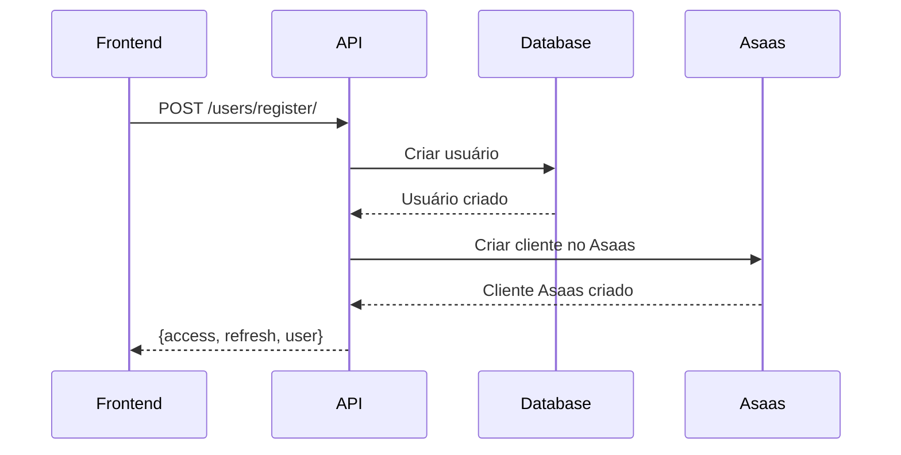
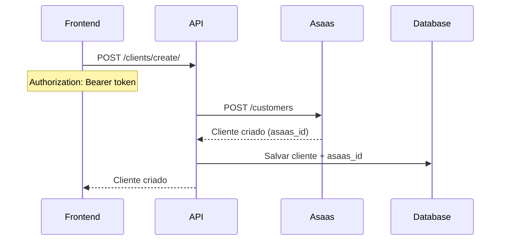
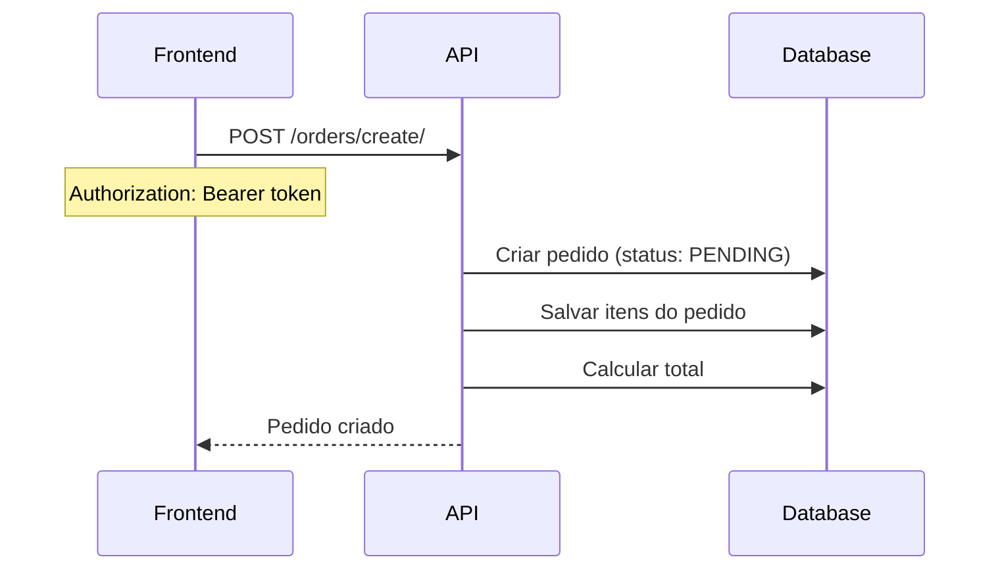
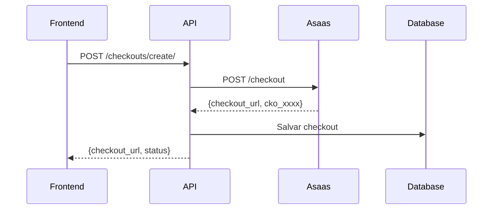
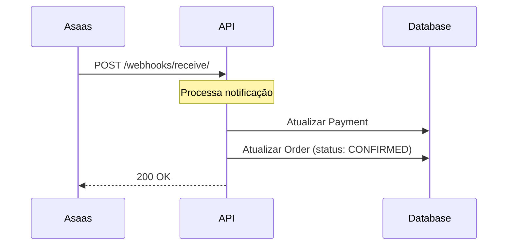
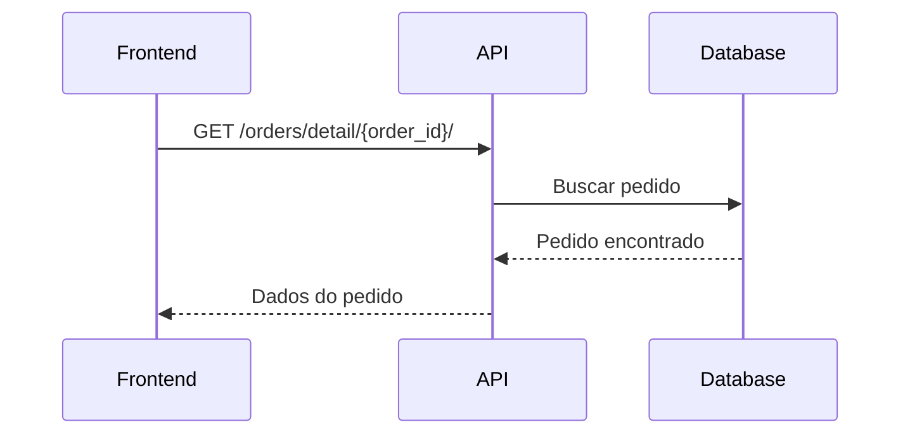
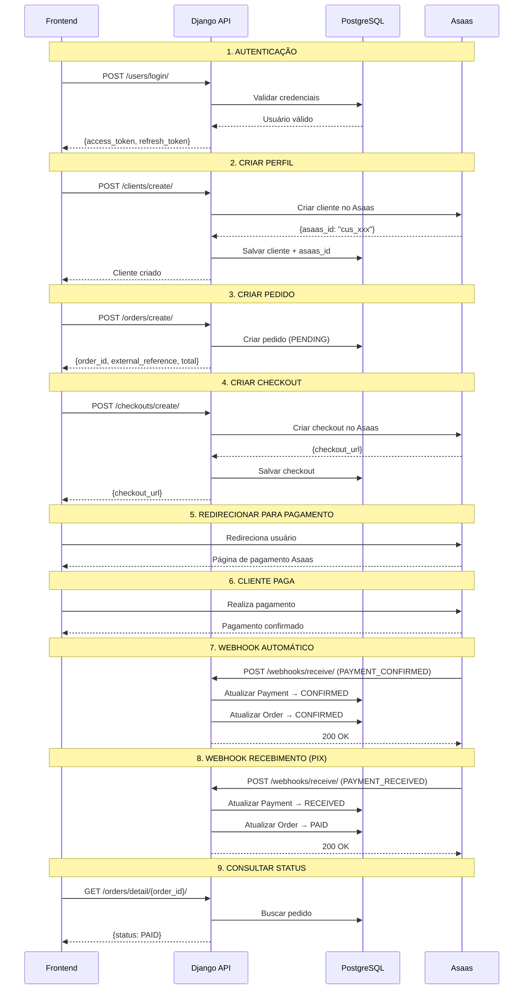

# 🔄 Fluxo Completo da API - Documentação Técnica

## 📋 Índice

1. [Visão Geral](#visão-geral)
2. [Arquitetura do Sistema](#arquitetura-do-sistema)
3. [Fluxos Principais](#fluxos-principais)
4. [Diagramas de Sequência](#diagramas-de-sequência)
5. [Casos de Uso](#casos-de-uso)
6. [Tratamento de Erros](#tratamento-de-erros)

---

## 🎯 Visão Geral

A API de Pagamento funciona como uma ponte entre o frontend, o sistema de pagamento Asaas e seu próprio banco de dados. O fluxo principal envolve:

1. **Autenticação** do usuário
2. **Criação** de pedidos
3. **Geração** de links de pagamento (checkout)
4. **Processamento** de pagamentos via webhook
5. **Atualização** automática de status

---

## 🏗️ Arquitetura do Sistema

### Módulos Principais

```
┌─────────────────┐
│   USUARIO       │ ← Autenticação e usuários
└─────────────────┘

┌─────────────────┐
│   CLIENTE       │ ← Perfil do cliente + Asaas
└─────────────────┘

┌─────────────────┐
│   PEDIDO        │ ← Gestão de pedidos
└─────────────────┘

┌─────────────────┐
│   CHECKOUT      │ ← Links de pagamento (Asaas)
└─────────────────┘

┌─────────────────┐
│   WEBHOOK       │ ← Recebe notificações do Asaas
└─────────────────┘

┌─────────────────┐
│   PAGAMENTO     │ ← Gestão de pagamentos (futuro)
└─────────────────┘
```

### Fluxo de Dados

```
Frontend → Django API → PostgreSQL
                    ↓
                   Asaas ← Webhook ← Asaas (confirmacao)
```

---

## 🔄 Fluxos Principais

### Fluxo 1: Autenticação e Registro

#### 1.1 Registro de Usuário



**Endpoint:** `POST /users/register/`

**Payload:**
```json
{
  "name": "João Silva",
  "email": "joao@example.com",
  "password": "MinhaSenh@123"
}
```

**O que acontece:**
1. Sistema valida os dados (email único, senha forte)
2. Cria usuário no PostgreSQL
3. **OPCIONAL**: Cria cliente no Asaas
4. Retorna tokens JWT (access + refresh)

**Response:**
```json
{
  "user": {
    "id": "uuid-1234",
    "name": "João Silva",
    "email": "joao@example.com"
  },
  "access": "eyJ0eXAi...",
  "refresh": "eyJ0eXAi...",
  "expires_at": 1733059200
}
```

#### 1.2 Login

**Endpoint:** `POST /users/login/`

**Payload:**
```json
{
  "email": "joao@example.com",
  "password": "MinhaSenh@123"
}
```

**O que acontece:**
1. Valida credenciais
2. Verifica se usuário existe
3. Verifica senha (bcrypt)
4. Gera novos tokens JWT
5. Retorna tokens

**Token expira em:** 1 hora (3600 segundos)

---

### Fluxo 2: Criação de Perfil de Cliente



**Endpoint:** `POST /clients/create/`

**Payload:**
```json
{
  "name": "João Silva",
  "cpf": "123.456.789-00",
  "phone": "11987654321",
  "mobile_phone": "11912345678",
  "address": {
    "address": "Rua das Flores",
    "number": "123",
    "complement": "Apto 45",
    "postal_code": "01234-567",
    "province": "Centro",
    "city": "São Paulo",
    "state": "SP"
  }
}
```

**O que acontece:**
1. Recebe dados do cliente
2. **Valida CPF** (algoritmo)
3. **Envia para Asaas** via API
4. Asaas retorna `asaas_id` (ex: `cus_xxxxxxxxxxxxx`)
5. Salva cliente local + `asaas_id` no banco
6. Cliente pode fazer pagamentos

---

### Fluxo 3: Criação de Pedido



**Endpoint:** `POST /orders/create/`

**Payload:**
```json
{
  "items": [
    {
      "product_id": "PROD001",
      "product_name": "Produto A",
      "quantity": 2,
      "unit_price": 150.00
    }
  ],
  "notes": "Pedido especial"
}
```

**O que acontece:**
1. Sistema recebe itens do pedido
2. Busca cliente do usuário logado (via token)
3. Calcula automaticamente:
   - `subtotal` = soma dos itens
   - `total` = subtotal (sem frete)
4. Gera `external_reference` única: `ORD_20241201120000_ABC12345`
5. Status inicial: `PENDING`
6. Retorna dados do pedido

**Response:**
```json
{
  "message": "Pedido criado com sucesso",
  "data": {
    "order_id": "uuid-1234",
    "external_reference": "ORD_20241201120000_ABC12345",
    "client": "João Silva",
    "subtotal": 389.90,
    "total": 389.90,
    "total_items": 3,
    "status": "PENDING",
    "created_at": "2024-12-01T12:00:00Z"
  }
}
```

**Status possíveis:**
- `PENDING` - Aguardando pagamento
- `CONFIRMED` - Confirmado (pagamento confirmado, aguardando liquidação)
- `PAID` - Pago e recebido (dinheiro na conta bancária)
- `PREPARING` - Em preparação (marcado manualmente)
- `CANCELLED` - Cancelado

---

### Fluxo 4: Criação de Checkout (Link de Pagamento)



**Endpoint:** `POST /checkouts/create/`

**Payload:**
```json
{
  "value": 389.90,
  "customer": "cus_xxxxxxxxxxxxx",
  "chargeTypes": ["DETACHED"],
  "minutesToExpire": 1440,
  "description": "Pedido ORD_20241201120000_ABC12345",
  "externalReference": "ORD_20241201120000_ABC12345",
  "paymentMethods": ["PIX", "CREDIT_CARD"],
  "successUrl": "https://seusite.com/success",
  "failureUrl": "https://seusite.com/failure",
  "items": [
    {
      "name": "Produto A",
      "value": 150.00,
      "quantity": 2
    }
  ]
}
```

**O que acontece:**
1. Sistema recebe dados do checkout
2. **Valida** que o cliente tem `asaas_id`
3. **Envia para Asaas** via API
4. Asaas cria checkout e retorna:
   - `checkout_url` (link para pagar)
   - `cko_xxxxxxxxxxxxx` (ID do checkout)
5. Sistema salva checkout no banco
6. Retorna URL para frontend

**Response:**
```json
{
  "message": "Checkout criado com sucesso",
  "data": {
    "local_id": "uuid-1234",
    "asaas_id": "cko_xxxxxxxxxxxxx",
    "checkout_url": "https://sandbox.asaas.com/checkout/cko_xxxxx",
    "value": 389.90,
    "status": "PENDING",
    "expires_at": "2024-12-02T12:00:00Z"
  }
}
```

---

### Fluxo 5: Processamento de Pagamento (Webhook)



**⚠️ IMPORTANTE:** Este é um fluxo AUTOMÁTICO. O Asaas chama sua API quando o pagamento é processado.

**Endpoint:** `POST /webhooks/receive/` (público, chamado pelo Asaas)

**Payload do Asaas:**
```json
{
  "event": "PAYMENT_CONFIRMED",
  "payment": {
    "id": "pay_xxxxxxxxxxxxx",
    "customer": "cus_xxxxxxxxxxxxx",
    "value": 389.90,
    "status": "CONFIRMED",
    "billingType": "PIX",
    "externalReference": "ORD_20241201120000_ABC12345",
    "paymentDate": "2024-12-01T12:05:00Z"
  }
}
```

**O que acontece AUTOMATICAMENTE:**
1. Asaas envia webhook para sua API
2. **Sistema salva** notificação no banco
3. **Busca o Payment** via `external_reference` ou `installment_id`
4. **Atualiza ou cria Payment** com status correto
5. **Atualiza Order** baseado no tipo de pagamento:
   - **Pagamento à vista (PIX):** 
     - `PAYMENT_CONFIRMED` → Order vai para `CONFIRMED`
     - `PAYMENT_RECEIVED` → Order vai para `PAID`
   - **Pagamento parcelado:**
     - `PAYMENT_CONFIRMED` (qualquer parcela) → Order vai para `CONFIRMED`
     - `PAYMENT_RECEIVED` (última parcela) → Order vai para `PAID`
     - Sistema conta quantas parcelas já foram pagas e só muda para PAID quando todas forem pagas
6. Responde 200 OK para Asaas

**Eventos de webhook suportados:**
- `PAYMENT_CONFIRMED` → Payment: CONFIRMED
  - Pagamento à vista: Order → CONFIRMED
  - Pagamento parcelado: Order → CONFIRMED (após 1ª parcela)
- `PAYMENT_RECEIVED` → Payment: RECEIVED
  - Pagamento à vista: Order → PAID
  - Pagamento parcelado: Order → PAID (após última parcela)
- `PAYMENT_REFUNDED` → Payment: REFUNDED, Order: CANCELLED
- `PAYMENT_CANCELLED` → Payment: CANCELLED, Order: CANCELLED
- `PAYMENT_FAILED` → Payment: FAILED, Order: CANCELLED

---

### Fluxo 6: Consulta de Status do Pedido



**Endpoint:** `GET /orders/detail/{order_id}/`

**O que acontece:**
1. Sistema busca pedido no banco
2. Retorna dados completos:
   - Informações do cliente
   - Itens do pedido
   - Valores (subtotal, total)
   - **Status atual**
   - Timestamps

**Response:**
```json
{
  "message": "Pedido encontrado",
  "data": {
    "order_id": "uuid-1234",
    "external_reference": "ORD_20241201120000_ABC12345",
    "client": {
      "id": "uuid-cliente",
      "name": "João Silva",
      "cpf": "123.456.789-00"
    },
    "items": [
      {
        "product_id": "PROD001",
        "product_name": "Produto A",
        "quantity": 2,
        "unit_price": 150.00,
        "total_price": 300.00
      }
    ],
    "subtotal": 389.90,
    "total": 389.90,
    "status": "CONFIRMED",
    "notes": "Pedido especial",
    "created_at": "2024-12-01T12:00:00Z",
    "confirmed_at": "2024-12-01T12:05:00Z"
  }
}
```

---

## 📊 Diagramas de Sequência

### Fluxo Completo de Compra



---

## 💻 Casos de Uso

### Caso de Uso 1: E-commerce - Compra Completa

#### Cenário
Cliente João quer comprar 2 unidades do Produto A (R$ 150,00 cada).

#### Passos

**1. Login**
```bash
POST /users/login/
{
  "email": "joao@example.com",
  "password": "MinhaSenh@123"
}
```
→ Recebe `access_token`

**2. Criar Pedido**
```bash
POST /orders/create/
Headers: { Authorization: Bearer access_token }
{
  "items": [
    {
      "product_id": "PROD001",
      "product_name": "Produto A",
      "quantity": 2,
      "unit_price": 150.00
    }
  ]
}
```
→ Recebe:
```json
{
  "order_id": "uuid-123",
  "external_reference": "ORD_20241201120000_ABC12345",
  "total": 300.00,
  "status": "PENDING"
}
```

**3. Criar Checkout**
```bash
POST /checkouts/create/
Headers: { Authorization: Bearer access_token }
{
  "value": 300.00,
  "customer": "cus_xxxxxxxxxxxxx",
  "externalReference": "ORD_20241201120000_ABC12345",
  "paymentMethods": ["PIX", "CREDIT_CARD"]
}
```
→ Recebe:
```json
{
  "checkout_url": "https://sandbox.asaas.com/checkout/cko_xxxxx"
}
```

**4. Redirecionar para Pagamento**
```javascript
window.location.href = "https://sandbox.asaas.com/checkout/cko_xxxxx"
```
→ Cliente paga no Asaas

**5. Webhook Automático (Fundo)**
```
Asaas → POST /webhooks/receive/ (PAYMENT_CONFIRMED)
→ Sistema atualiza: Order.status = CONFIRMED

Asaas → POST /webhooks/receive/ (PAYMENT_RECEIVED)
→ Sistema atualiza: Order.status = PAID (se última parcela)
```

**6. Verificar Status**
```bash
GET /orders/detail/uuid-123/
```
→ Recebe: `status: CONFIRMED` ou `PAID` dependendo do webhook recebido

---

### Caso de Uso 2: Consulta de Pedidos

#### Cenário
João quer ver todos os seus pedidos.

#### Passos

**1. Listar Pedidos**
```bash
GET /orders/my-orders/
Headers: { Authorization: Bearer access_token }
```

**Response:**
```json
{
  "data": [
    {
      "order_id": "uuid-1",
      "external_reference": "ORD_001",
      "total": 300.00,
      "status": "CONFIRMED",
      "created_at": "2024-12-01T12:00:00Z"
    },
    {
      "order_id": "uuid-2",
      "external_reference": "ORD_002",
      "total": 150.00,
      "status": "PENDING",
      "created_at": "2024-12-01T14:00:00Z"
    }
  ]
}
```

---

### Caso de Uso 3: Cancelamento de Pedido

#### Cenário
João quer cancelar um pedido que ainda está PENDING.

#### Passos

**1. Cancelar Pedido**
```bash
POST /orders/cancel/uuid-2/
Headers: { Authorization: Bearer access_token }
```

**Response:**
```json
{
  "message": "Pedido cancelado com sucesso",
  "data": {
    "order_id": "uuid-2",
    "status": "CANCELLED"
  }
}
```

**Regras de negócio:**
- ✅ Pode cancelar se status = `PENDING` ou `CONFIRMED`
- ❌ NÃO pode cancelar se status = `CANCELLED`
- ⚠️ Se já tem pagamento, precisa fazer estorno primeiro

---

## 🚨 Tratamento de Erros

### Erro 1: Token Expirado

**Sintoma:**
```json
{
  "detail": "Token não informado"
}
```
**Status:** 401 Unauthorized

**Solução:**
```javascript
// Chamar refresh token
POST /users/refresh-token/
{
  "refresh": "eyJ0eXAi..."
}
```

### Erro 2: Cliente Não Existe

**Sintoma:**
```json
{
  "error": "Cliente não encontrado para o usuário"
}
```
**Status:** 404 Not Found

**Solução:**
Criar perfil de cliente:
```bash
POST /clients/create/
```

### Erro 3: CPF Inválido

**Sintoma:**
```json
{
  "cpf": ["CPF inválido"]
}
```
**Status:** 400 Bad Request

**Solução:**
Fornecer CPF válido (algoritmo corretor)

### Erro 4: Pedido Não Pode Ser Cancelado

**Sintoma:**
```json
{
  "error": "Pedido não pode ser cancelado. Status atual: CONFIRMED"
}
```
**Status:** 400 Bad Request

**Solução:**
- Status `CANCELLED` não pode ser cancelado
- Fazer estorno antes de cancelar

### Erro 5: Item Sem Quantidade

**Sintoma:**
```json
{
  "items": ["O pedido deve ter pelo menos um item."]
}
```
**Status:** 400 Bad Request

**Solução:**
Enviar pelo menos 1 item no pedido

---

## 🔐 Segurança

### Autenticação JWT

**Como funciona:**
1. Usuário faz login
2. Sistema gera token JWT
3. Token contém: `user_id`, `email, `exp`
4. Cliente envia token em todas as requisições
5. Sistema valida token antes de processar

**Validações:**
- ✅ Token não expirado (`exp`)
- ✅ Token não está na blacklist
- ✅ Assinatura válida

### Webhook Asaas

**Como funciona:**
1. Asaas envia webhook para: `https://seudominio.com/webhooks/receive/`
2. Payload inclui evento de pagamento
3. Sistema processa automaticamente

**Proteções:**
- ✅ Endpoint público (sem auth)
- ⚠️ Validar payload recebido
- ⚠️ Implementar idempotência

---

## 📝 Resumo Executivo

### Fluxo Simplificado

```
1. Login (obter token)
   ↓
2. Criar Perfil (obter asaas_id)
   ↓
3. Criar Pedido (obter order_id)
   ↓
4. Criar Checkout (obter checkout_url)
   ↓
5. Redirecionar para pagamento
   ↓
6. Cliente paga no Asaas
   ↓
7. Asaas envia webhook (automático)
   ↓
8. Sistema atualiza status (automático)
   ↓
9. Verificar status do pedido
```

### Pontos Importantes

1. **Webhook é AUTOMÁTICO** - não precisa fazer nada
2. **external_reference** conecta Order ↔ Payment
3. **asaas_id** é necessário para criar checkout
4. **Status segue ciclo:** 
   - À vista: PENDING → CONFIRMED → PAID
   - Parcelado: PENDING → CONFIRMED (1ª parcela) → PAID (última parcela)
5. **Total = Subtotal** (sem frete)

---

**🎯 Esta documentação cobre todo o fluxo de ponta a ponta da API!**

